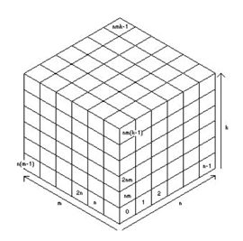

## 문제

After ruling a large chunk of the Milky Way for millennia, the Cosmic OBsolescent OLigarchy is finally breaking up into a collection of independent monarchies. COBOL is a very organized empire and takes the shape of a gigantic cube with dimensions n by m by k parsecs. (COBOL is also very secretive, so only a few know the exact values of n, m and k.) To facilitate the control of the empire it is partitioned into nmk smaller dominions, each 1 cubic parsec in size. These dominions are numbered as follows:

Each independent monarchy is a connected collection of one or more dominions (a dominion is connected to another if they share a face) and over a period of several imperial months, one monarchy per month will secede from the empire. Each secession begins at the first day of the month. One concern of COBOL is that during the breakup, various parts of the remaining empire may become disconnected from one another, which could hamper the administration of what’s left of the empire. Your job is to determine the number of months of the breakup during which the empire is disconnected.

## 입력

Input will consist of multiple problem instances. The first line will contain a positive integer indicating the number of problem instances to follow. The first line of each problem instance will contain four integers: nmkl, where n, m and k are as described above, with 1 ≤ n, m, k ≤ 30, and l is the number of independent monarchies which the empire is being divided into. Following this will be l lines defining the monarchies. Each will have the form p d1 d2 d3 ... dp, where p is the number of dominions making up the monarchy (1 ≤ p ≤ 20), and d1,...,dp are the dominions. The monarchies are listed in the order in which they will secede from the empire.

## 출력

Output for each problem instance should consist of a single integer on a line, indicating the number of months which the empire was disconnected.
