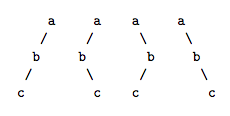

## 문제

이진 트리를 인오더(in-order)와 포스트오더(post-order)로 순회한 결과가 주어졌을 때, 프리오더(pre-order)로 순회한 결과를 찾을 수 있다. 또, 인오더와 포리오더로 순회한 결과가 주어졌을 때, 포스트오더로 순회한 결과도 쉽게 찾을 수 있다. 하지만, 프리오더와 포스트오더로 순회한 결과가 주어졌을 때는, 인오더로 순회한 결과를 구할 수 없다.

아래 이진 트리 4개를 보자.

위의 트리는 같은 프리오더와 포스트오더를 갖는 트리이다. 이러한 현상은 이진 트리에서만 나타나는 것이 아니고, 모든 m진 트리(자식이 최대 m개인 트리)에서 나타난다.

m진 트리를 프리오더와 포스트오더로 순회한 결과가 주어졌을 때, 이러한 순회 결과를 갖는 트리의 개수를 출력하는 프로그램을 작성하시오.

## 입력

입력은 여러 개의 테스트 케이스로 이루어져 있다. 각 테스트 케이스는 다음과 같은 형식이다.

m s1 s2

이 뜻은 m진트리를 프리오더 순회한 결과가 s1, 포스트오더로 순회한 결과가 s2라는 뜻이다. (1 ≤ m ≤ 20, 1 ≤ s1,s2의 길이 ≤ 26, s1의 길이 = s2의 길이) s1의 길이가 k일 때, 알파벳 첫 k개 문자가 사용된다. 마지막 줄은 0이 주어진다.

## 출력

각 테스트 케이스에 대해서, 입력으로 주어진 프리오더와 포스트오더 순회 결과를 갖는 m진트리의 개수를 출력한다. 이 결과는 항상 부호있는 32비트 정수 범위이다. 입력으로 주어진 결과를 이용해서 트리를 적어도 하나는 만들 수 있다.
