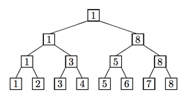

## 문제

In a knockout tournament there are 2n players. One loss and a player is out of the tournament. Winners then play each other with the new winners advancing until there is only one winner left. If we number the players 1, 2, 3,..., 2n, with the first round pairings 2k−1 vs 2k, for k = 1, 2,..., 2n−1, then we could give the results of the tournament in a complete binary tree. The winners are indicated in the interior nodes of the tree. Below is an example of a tournament with n = 3.



After the tournament, some reporters were arguing about the relative ranking of the players, as determined by the tournament results. It’s assumed that if player A beats player B who in turn beats player C, that player A will also beat player C; that is, winning is transitive. Now there is no doubt who the best player is. The question is what is the highest ranking a player can reasonably claim as a result of the tournament and what is the worst ranking a player can have, as a result of the tournament? For example, in the above tournament player 2, having lost to the eventual winner, could claim to be the 2nd best player in the field, but could well be the worst (ranked 8th). Player 5 could claim to be as high as 3rd (having lost to someone who could be 2nd) but no worse than 7th (having beaten one player in the 1st round).

You are to determine the highest and lowest possible rankings of a set of players in the field, given the results of the tournament.

## 입력

There will be multiple input instances. The input for each instance consists of three lines. The first line will contain a positive integer n < 8, indicating there are 2n players in the tournament, numbered 1 through 2n, paired in the manner indicated above. A value of n = 0 indicates end of input. The next line will contain the results of each round of the tournament (listed left-to-right) starting with the 1st round. For example, the tournament above would be given by

```

1 3 5 8 1 8 1
```

The final line of input for each instance will be a positive integer m followed by integers k1, ..., km, where each ki is a player in the field.

## 출력

For each ki, issue one line of output of the form:

```

Player ki can be ranked as high as h or as low as l.
```

where you supply the appropriate numbers. These lines should appear in the same order as the ki did in the input. Output for problem instances should be separated with a blank line.
