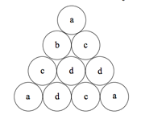

## 문제

The International Betting Machine company has just issued a new type of slot machine. The machine display consists of a set of identical circles placed in a triangular shape. An example with four rows is shown below. When the player pulls the lever, the machine places a random letter in the center of each circle. The machine pays off whenever any set of identical letters form the vertices of an equilateral triangle. In the example below, the letters ‘a’ and ‘c’ satisfy this condition.



In order to prevent too many payoffs, the electronics in the machine ensures that no more than 3 of any letter will appear in any display configuration.

IBM is manufacturing several models of this machine, with varying number of rows in the display, and they are having trouble writing code to identify winning configurations. Your job is to write that code.

## 입력

Input will consist of multiple problem instances. Each instance will start with an integer n indicating the number of rows in the display. The next line will contain n(n + 1)/2 letters of the alphabet (all lowercase) which are to be stored in the display row-wise, starting from the top. For example, the display above would be specified as

```

4
abccddadca
```

The value of n will be between 1 and 12, inclusive. A line with a single 0 will terminate input.

## 출력

For each problem instance, output all letters which form equilateral triangles on a single line, in alphabetical order. If no such letters exist, output “LOOOOOOOOSER!”.
