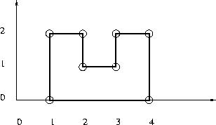

## 문제

Given is n points with integer coordinates in the plane. Is it is possible to construct a simple, that is non-intersecting, rectilinear polygon with the given points as vertices? In a rectilinear polygon there are at least 4 vertices and every edge is either horizontal or vertical; each vertex is an endpoint of exactly one horizontal edge and one vertical edge. There are no holes in a polygon.

## 입력

The first line of input is an integer giving the number of cases that follow. The input of each case starts with an integer 4 ≤ n ≤ 100000 giving the number of points for this test case. It is followed by n pairs of integers specifying the x and y coordinates of the points for this case.

## 출력

The output should contain one line for each case on input. Each line should contain one integer number giving the length of the rectilinear polygon passing throught the given points when it exists; otherwise, it should contain -1.
