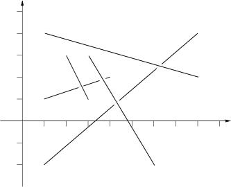

## 문제

Stan has *n* sticks of various length. He throws them one at a time on the floor in a random way. After finishing throwing, Stan tries to find the top sticks, that is these sticks such that there is no stick on top of them. Stan has noticed that the last thrown stick is always on top but he wants to know all the sticks that are on top. Stan sticks are very, very thin such that their thickness can be neglected.

## 입력

Input consists of a number of cases. The data for each case start with *1 ≤ n ≤ 100000*, the number of sticks for this case. The following *n* lines contain four numbers each, these numbers are the planar coordinates of the endpoints of one stick. The sticks are listed in the order in which Stan has thrown them. You may assume that there are no more than 1000 top sticks. The input is ended by the case with *n=0*. This case should not be processed.

## 출력

For each input case, print one line of output listing the top sticks in the format given in the sample. The top sticks should be listed in order in which they were thrown.

The picture to the right below illustrates the first case from input.
