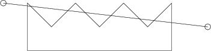

## 문제

Given is a simple but not necessarily convex polygon. Given is also a line in the plane. If the polygon is cut along the line then we may get several smaller polygons. Your task is to find the length of the cut, that is the total length of the segments in the intersection of the line and the polygon.

## 입력

Input consists of a number of cases. The data of each case appears on a number of input lines, the first of which contains two non negative integers n and m giving the number of the vertices of the polygon and the number of cutting lines to consider, 3 ≤ n ≤ 1000. The following n lines contain coordinates of the vertices of the polygon; each line contains the x and y coordinates of a vertex. The vertices are given either in clockwise or counterclockwise order. Each of the following m lines of input contains four numbers; these are x and y coordinates of the two points defining the cutting line. If a vertex of the polygon is closer than 10e-8 to the cutting line then we consider that the vertex lies on the cutting line.

Input is terminated by a line with n and m equal to 0.

## 출력

For each cutting line, print the total length of the segments in the intersection of the line and the polygon defined for this test case, with 3 digits after the decimal point. Note: the perimiter of a polygon belongs the polygon.

## 힌트

The picture above illustrates the first cutting line for the polygon from the sample.
