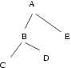

## 문제

The following grammar describes a textual notation for a tree with (not necessarily unique) vertex labels:

```

tree ::= label
tree ::= label ( subtrees )
subtrees ::= tree
subtrees ::= subtrees , tree
label ::= A | B | C | ... | Z
```

That is, the representation of a tree consists of a label (which is an uppercase letter) or a label followed by a bracketed ordered list of trees separated by commas.

In order to draw such a tree on paper, we must write each label on the page, such that the labels for the subtrees of a vertex are positioned counter-clockwise about the vertex. The labels must be positioned such that non-intersecting line segments connect each vertex to each of its subtrees. That is to say, we draw the normal planar representation of the tree, preserving the order of subtrees. Beyond these constraints, the position, shape, and size of the representation is arbitrary.

For example, a possible graphical representation for A(B(C,D),E) is .

Given the textual representation for two trees, you are to determine whether or not they are equivalent. That is, do they share a common paper representation?

## 입력

The first line of input contains t, the number of test cases. Each test case consists of two lines, each specifying a tree in the notation described above. Each line will contain at most 200 characters, and no white space.

## 출력

For each test case, output a line containing "same" or "different" as appropriate.
