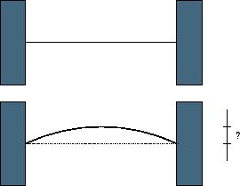

## 문제

When a thin rod of length L is heated n degrees, it expands to a new length L'=(1+n\*C)\*L, where C is the coefficient of heat expansion.

When a thin rod is mounted on two solid walls and then heated, it expands and takes the shape of a circular segment, the original rod being the chord of the segment.

Your task is to compute the distance by which the center of the rod is displaced.

## 입력

The input contains multiple lines. Each line of input contains three non-negative numbers: the initial lenth of the rod in millimeters, the temperature change in degrees and the coefficient of heat expansion of the material. Input data guarantee that no rod expands by more than one half of its original length. The last line of input contains three negative numbers and it should not be processed.

## 출력

For each line of input, output one line with the displacement of the center of the rod in millimeters with 3 digits of precision.
