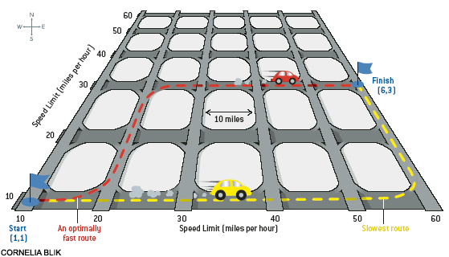

## 문제

Consider a grid in which north-south streets, separated by gaps of 10 miles each, are elevated above east-west streets laid out in a similar fashion (see illustration for the case of a 6 by 6 grid). All streets are two-way. Entrance and exit ramps connect the streets at every intersection. Because there are no traffic lights, switching from a north-south street to an east-west street, and vice versa, takes essentially no time. The grid has very little traffic, but the local police patrol so carefully for speeding that there are virtually no speeders.

The speed limits follow an unusual pattern. The speed limits are separately posted for each street and are the same for the entire street in both directions. In the illustration above, let us label the intersections using their column and row numbers: the southwestern corner of the grid is (1, 1), the southeastern corner is (6, 1), and so on. Part of your task is to determine the shortest time in which we can get from (1, 1) to (6, 3) while obeying speed limits.

However, after the Kyoto disagreement, just being fast is not good enough, one also has to be fuel efficient. Fuel consumption of a car is given in miles-per-gallon (mpg) and depends on speed of the car. Speed of a car is given in miles-per-hour (mph) and, in this digital age, the speed of a car is always a positive integer multiple of 5. The formula relating mpg to mph is a very simple one: a car travelling at v mph makes 80-0.03\*v2 mpg. In a given grid of streets we would like to travel from intersection (xs, ys) to intersection (xt, yt). You are to determine the fastest and the most fuel efficient way of making the trip such that:

* the car does not change speed between intersections,
* the car obeys all speed limits,
* the car travels the shortest possible distance between the start and finish, and
* the car arrives at the destination in the given time interval.

## 입력

The first line of input contains an integer t, the number of scenarios to be processed. The data for each scenario occupy 5 lines. The first line contains an integer n<=10 which is the number of horizontal and vertical streets. The second line contains an integer which is the grid unit size in miles, smaller than 100. The third and fourth lines contain n integers each, specifying the speed limits on the horizontal and vertical streets, respectively. The largest speed limit is 50. The last line of data for a scenario contains 6 integers. The first four are xs, ys, xt, and yt. The last two integers give the shortest and the longest allowed time to travel in minutes, inclusive, both not bigger than 1000.

## 출력

For each scenario, output two or three lines in the format given in the sample output. If the travel is possible then, on the second line of output, report the earliest possible arrival time (but within the imposed limits) and fuel consumed (least possible for this travel time) and, on the third line, report the earliest arrival time (but within the imposed limits) that consumes the minimum amount of fuel. The time is to be reported in minutes (integer), rounded up.
