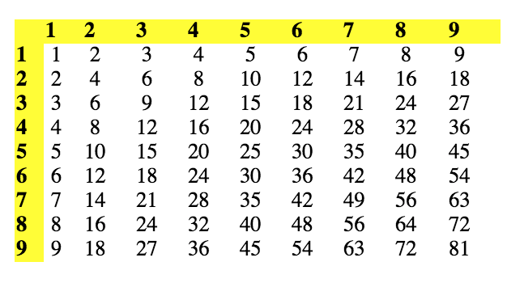

## 문제

The multiplicative persistence of a number is defined by Neil Sloane (Neil J.A. Sloane in The Persistence of a Number published in Journal of Recreational Mathematics 6, 1973, pp. 97-98., 1973) as the number of steps to reach a one-digit number when repeatedly multiplying the digits. Example:

679 -> 378 -> 168 -> 48 -> 32 -> 6.

That is, the persistence of 679 is 5. The persistence of a single digit number is 0. At the time of this writing it is known that there are numbers with the persistence of 11. It is not known whether there are numbers with the persistence of 12 but it is known that if they exists then the smallest of them would have more than 3000 digits.

The problem that you are to solve here is: what is the smallest number such that the first step of computing its persistence results in the given number?

## 입력

For each test case there is a single line of input containing a decimal number with up to 1000 digits. A line containing -1 follows the last test case.

## 출력

For each test case you are to output one line containing one integer number satisfying the condition stated above or a statement saying that there is no such number in the format shown below.
