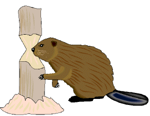
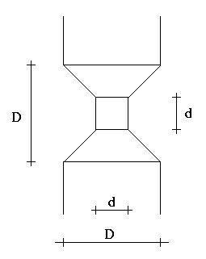

## 문제

We will consider an idealized beaver chomping an idealized tree. Let us assume that the tree trunk is a cylinder of diameter D and that the beaver chomps on a segment of the trunk also of height D. What should be the diameter d of the inner cylinder such that the beaver chmped out V cubic units of wood?

## 입력

Input contains multiple cases each presented on a separate line. Each line contains two integer numbers D and V separated by whitespace. D is the linear units and V is in cubic units. V will not exceed the maximum volume of wood that the beaver can chomp. A line with D=0 and V=0 follows the last case.

## 출력

For each case, one line of output should be produced containing one number rounded to three fractional digits giving the value of d measured in linear units.
