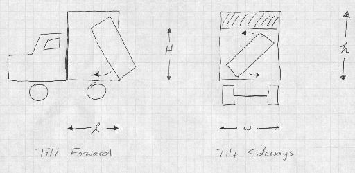

## 문제

To save money you are considering renting a small cube van to transport your belongings to the Big City. The interior of the van is a rectangular box with width w, height h, and length l. The box has a sliding door that lifts but only to height H. That is, there is an immovable overhang of height H-h at the top of the door.

You have a large rectangular box that you wish to load on the truck. Can you get it on the truck subject to the following constraints:

* The box must fit through the door, tilting it forward or sideways (but not both) as necessary (see figure below).
* The box must be placed with one side flat against the floor.
* The box must be placed with one side flat against the front wall.
* The door must close once the box is in place.

You may assume there are no obstructions (such as a ceiling or the ground) outside the truck that might interfere with loading.

## 입력

There are several test cases, each represented by two lines of input. The first line of each contains 4 integers: w, h, l, H. The next line contains 3 integers - the dimensions of the box.

## 출력

For each test case, print "The box goes on the truck." if it is possible to load the box on the truck; otherwise print "The box will not go on the truck." You may assume that you start with an empty truck for each test case.
