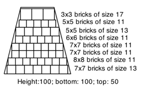

## 문제

The Dwarves of Middle Earth are renowned for their delving and smithy ability, but they are also master builders. During the time of the dragons, the dwarves found that above ground the buildings that were most resistant to attack were truncated square pyramids (a square pyramid that does not go all the way up to a point, but instead has a flat square on top).

The dwarves knew what the ideal building shape should be based on the height they wanted and the size of the square base at the top and bottom. They typically had three different sizes of cubic bricks with which to work. Their goal was to maximize the volume of such a building based on the following rules:

The building is constructed of layers; each layer is a single square of bricks of a single size. No part of any brick may extend out from the ideal shape, either to the sides or at the top. The resulting structure will have jagged sides and may be shorter than the ideal shape, but it must fit completely within the ideal design. The picture at the right is a vertical cross section of one such tower.

There is no limit on how many bricks of each type can be used.

## 입력

Each line of input will contain six entries, each separated by a single space. The entries represent the ideal temple height, the size of the square base at the bottom, the size of the square base at the top (all three as non-negative integers less than or equal to one million), then three sizes of cubic bricks (all three as non-negative integers less than or equal to ten thousand). Input is terminated upon reaching end of file.

## 출력

For each line of input, output the maximum possible volume based on the given rules, one output per line.
