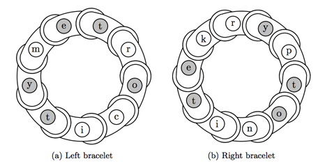

## 문제

Finally, Megamind has devised the perfect plan to take down his arch-nemesis, Metro Man! Megamind has designed a pair of circular power bracelets to be worn on his left and right wrists. On each bracelet, he has inscribed a sequence of magical glyphs (i.e., symbols); each activated glyph augments Megamind’s strength by the might of one grizzly bear!

However, there’s a catch: the bracelets only work when the subsequences of glyphs activated on each bracelet are identical. For example, given a pair of bracelets whose glyphs are represented by the strings “metrocity” and “kryptonite”, then the optimal activation of glyphs would give Megamind the power of 10 grizzly bears:

Figure 1: Megamind’s power bracelets

On the first bracelet, the letters “etoty” are activated in clockwise order; the same letters are activated in counterclockwise order on the second bracelet. Generally, the ordering of the letters is important, but the orientation of the activated subsequence on each bracelet (i.e., clockwise or counterclockwise) may or may not be the same—and don’t forget that the bracelets are circular!

Help Megamind defeat Metro Man by determining the optimal subsequences of glyphs needed to activate his bracelets.

## 입력

The input file will contain at most 100 test cases (including at most 5 “large” test cases). Each test case is given by a single line containing a space-separated pair of strings s and t, corresponding to the sequences of glyphs on Megamind’s left and right power bracelets, respectively. Each string will consist of only lowercase letters (‘a’-‘z’). The length of each input string will be between 1 and 100 characters, inclusive, except for the large test cases where the length of each input string will be between 1 and 1500 characters, inclusive.

## 출력

For each input test case, print the maximum power (in units of grizzly bears) that Megamind will be able to achieve by activating glyphs on his bracelets.
