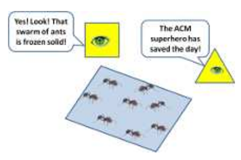

## 문제

Flatland needs a superhero! Recently swarms of killer ants have been invading Flatland, and nobody in Flatland can figure out how to stop these dastardly denizens. Fortunately, you (as a higher dimensional being) have the opportunity to become a superhero in the eyes of the Flatland citizens! Your job is to “freeze” swarms of ants using parallelograms. You will do this by writing a program that finds a minimal area enclosing parallelogram for each swarm of ants. Once a minimal area parallelogram is placed around the ant swarm, they are effectively frozen in place and can no longer inflict terror on planar inhabitants.

Figure 2: A Frozen Swarm of Ants in Flatland

## 입력

The input will consist of the following:

* A line containing a single integer, s (1 ≤ s ≤ 20), which denotes the number of killer ant swarms.
* Each swarm will start with a single line containing an integer, n (4 ≤ n ≤ 1000), which indicates the number of killer ants in the swarm.
* The next n lines contain the current location of each killer ant in the swarm.
* Each killer ant is represented by a single line containing two numbers: x (−1000 ≤ x ≤ 1000) and y (−1000 ≤ y ≤ 1000) separated by a space.
* Only one killer ant will occupy each (x, y) location in a particular swarm. Each swarm should be dealt with independently of other swarms.
* All data inputs are in fixed point decimal format with four digits after the decimal (e.g., dddd.dddd).
* There may be multiple parallelograms with the same minimum area.

## 출력

For each swarm, your algorithm should output a line that contains “Swarm i Parallelogram Area: ”, where i (1 ≤ i ≤ s) is the swarm number, followed by the minimum area (rounded to 4 decimal digits and using fixed point format) of an enclosing parallelogram for that swarm. All computations should be done using 64 bit IEEE floating point numbers, and the final answers displayed in fixed point decimal notation and rounded to four decimal digits of accuracy as shown in the sample input and output.
