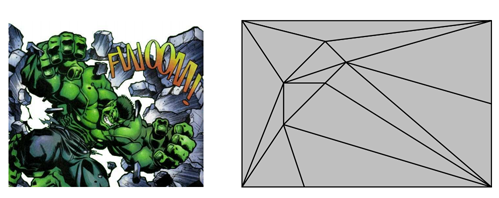
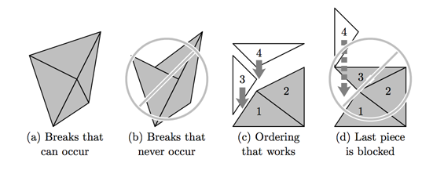

## 문제

Remember the big fight where the Hulk and the Abomination threw each other through the buildings of Manhattan? Or the time when the Green Goblin smashed poor Spider-Man through a good half-dozen brick walls? Wow, they must have shattered those walls into a million pieces!!!

It’s great that we have superheroes to bring the villains to justice, but have you ever wondered who gets to repair all the collateral damage when they’re done? Well actually, as president of the Action Cleanup Management (ACM) corporation, your job is to do exactly that! After a big fight, you must take all the broken pieces of the walls and put them back together just as they were before the fierce battle began.

Figure 3: A wall broken into many pieces.

A wall is a perfectly rectangular region that shatters into perfectly triangular pieces when a villain is sent through it (see Figure 3). Through sophisticated visual analysis, you have ascertained where in the original structure every little piece came from. In essence, you have a blueprint that looks a lot like the picture above. Furthermore, you observe that wherever two broken pieces meet, they meet along the full length of the break (edge) that separates them, as shown in Figure 4a.

Figure 4: The good, the bad, and the ugly.

You have an assembly robot that can help you reconstruct a wall in place. However, the robot can only lower each piece, one at a time, straight down from the top. The robot cannot move a piece from side to side or rotate it in any way to get it where it needs to go. Thus, you must be careful regarding the order in which you tell the robot to reassemble the broken pieces, lest you inadvertently block a piece from being lowered into its proper place (see Figure 4d). Can you determine an ordering of the pieces for each wall that will allow you to fully reassemble it?

## 입력

An integer on the first line of the input file indicates the number of walls you must reassemble. The first line for each wall has an integer, n, indicating the number of triangular pieces the wall was broken into (2 ≤ n ≤ 1,000,000). Then, n lines of input follow, each describing a piece with six integers, x1 y1 x2 y2 x3 y3, that correspond to the Cartesian (x, y) coordinates of the three corners of a triangle on the original wall from which the piece came. The first line describes piece 1, the next line piece 2, and so forth. The three points will always be given in a counterclockwise winding order and form a triangle of non-zero area. All coordinates lie between 0 and 109 inclusive, with the positive y direction being the “up” direction. The n pieces given will cover a rectangular region exactly, with no gaps or overlaps.

## 출력

For each wall, output on a single line the numbers of the pieces, separated by spaces, in an order that will allow your robot to reassemble the wall. If more than one correct solution exists, any ordering that will work is acceptable.
