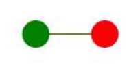
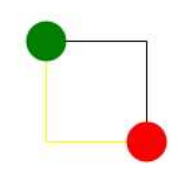
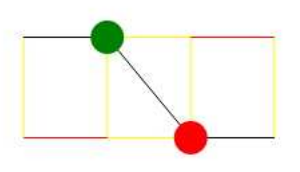
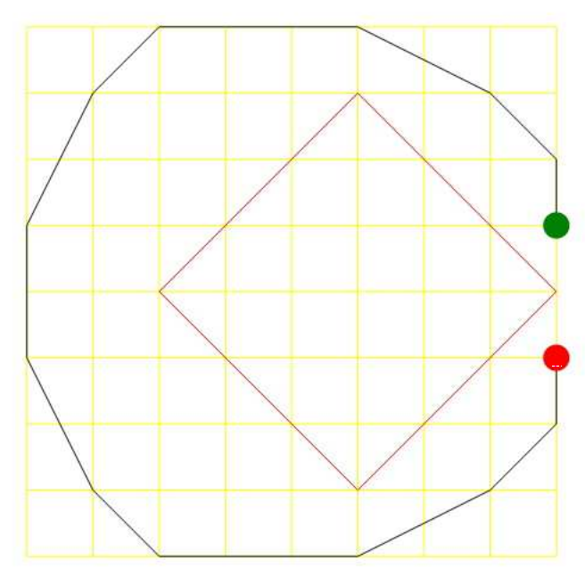
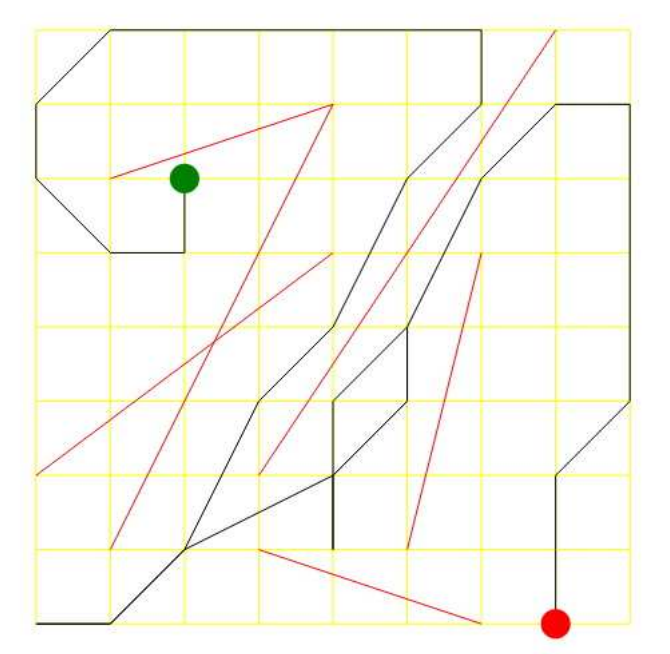

## 문제

LeaperLad wakes in LatticeLand on a disk suspended above a lake of lava. Leaper spies his HeloPak on one of the disks; with it he knows he can escape this nefarious trap.

The disks are quite far apart, however; without some momentum, he can only jump to an immediately adjacent disk. Once he has acquired the speed to make that jump, he can accelerate on every disk he touches.

He notices the disks are laid out in a rectangular grid, with a disk on each grid point. He calculates that on each disk he can accelerate or decelerate his speed by one unit in the horizontal or vertical direction (but not both on the same disk). Alternatively, he can just maintain his speed when stepping on a disk. Thus, in a straight line, from a standing start, he can jump one unit, then two units, then three, then two, then one.

Some pairs of disks are joined by walls of fire that he knows he must not touch. He can get arbitrarily close to one of these walls, but he must not touch one. Nor can he fall off the edge of the grid.

How quickly can LeaperLad reach his HeloPak and stop on that disk?

## 입력

Input will have one problem per input line. The input line will contain a sequence of integers, each separated by a single space.

The first two integers will be w and h, the width and height of the grid. Each of these values will be between 1 and 64, inclusive. Following that will be two integers representing the coordinates of the disk that LeaperLad wakes on. After that will be two integers representing the coordinates of the disk that the HeloPak is on. The next integer will be f, the number of fire walls. There will be six or fewer fire walls. After that will be f sets of 4 integers, representing the two coordinates of the end points of the walls.

For all coordinates, the first number will be between 0 and w − 1, inclusive, and the second number will be between 0 and h − 1, inclusive. All fire walls will be at least one unit long. The HeloPak and LeaperLad will never start on the same disk, nor will either start on a disk that is on a firewall. There will always be a way for LeaperLad to reach his HeloPak.

There will be no more than 50 problems.

## 출력

For each input line, print a single integer indicating the minimal number of moves needed for LeaperLad to reach his HeloPack. Pay close attention to the first couple of examples; they clarify how moves are counted.

## 힌트

Example 1

This requires two moves. In the first move, LeaperLad accelerates one unit in the positive x direction, and hops onto the destination disk. In the second move, he decelerates to the required speed of zero (note that although LeaperLad’s position does not change during the second move, it nonetheless counts towards the total).

Example 2

This requires four moves. LeaperLad first moves to the right, as in the prior example, but he must decelerate in the x direction first, then accelerate in the y direction to jump down, then decelerate again to become motionless.

Example 3

This requires eight moves. LeaperLad cannot jump diagonally from a standing stop; he needs to back up to get some momentum first. So first he must move to position (0, 0), then decelerate to turn around, then accelerate in the x direction while jumping to his original location. His momentum allows him to accelerate in the y direction to make a diagnoal move. Once landing at his destination, he has one unit of momentum in both x and y directions, so he must decelerate, first in the y direction (which takes him to position (3, 1), overshooting his destination). Then he decelerates to turn around, jumps to his destination once more, and then decelerates to be motionless, for a total of eight moves.

Example 4

This requires 16 moves.

Example 5

This requires 43 moves.
