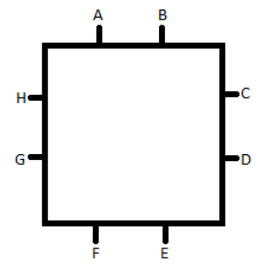
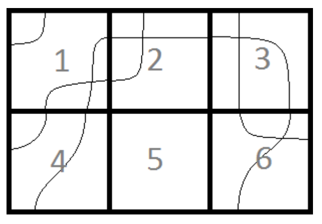

## 문제

Dr. Horrible desperately wants to get into the Evil League of Evil but is having a difficult time proving his competence as the mastermind that he is. Bad Horse rules over the league with an iron hoof and is evaluating his application with extreme skepticism. Meanwhile, arch-nemesis Captain Hammer, hero of the people and corporate tool, is making life exceedingly complicated for our poor villain. But, everything is about to change. Dr. Horrible is all set to pull off a major heist; the wondeflonium needed to complete work on his freeze ray is being transported by courier van—candy from a baby. Sadly, it’s not as easy as Dr. Horrible suspected. The device he created to control the van became a jumble of wires that needs to be untangled. He’d have Moist, his roommate, do it, but it’s probably a bad idea to have Moist anywhere near circuitry (for obvious reasons). You better do it and do it fast, or else it’s curtains for you—lacy, gently wafting curtains.

Figure 5: Connection point labels

You can help by figuring out a given wire’s ending position based on its starting position for a variety of circuit boards. Here circuit boards are rectangular grids of squares, and each square has 8 connection points, two on each side. Squares also have any number of wires (between 0 and 4 inclusive) connecting one connection point of the square to another. A connection point for a square can only be used by one wire or not be used at all; there is no branching. By naming the square’s connection points alphabetically from A to H (always capitalized) starting with the left connection on the top edge and traveling clockwise, you can describe each square as the collection of wires traveling from one named point to another. For example, if a square has a wire traveling from the left connection on the top edge to the bottom connection on the right edge, a wire from the left connection of the bottom edge to the right connection of the bottom edge, and a wire from the right connection of the top edge to the top connection of the left edge then you could describe the square as AD BH EF. For consistency, each wire pair is described alphabetically (BH instead of HB), and all the wire pairs for each square are listed in alphabetical order when describing a square.

Squares are aligned next to each other on all sides to make up the circuit board. For any given square, connection points A and B connect with F and E respectively with the square above it, and vice versa for the square below it. Connection points C and D connect with H and G respectively with the square to its right, and vice versa for the square to its left. If a square has a wire to any given connection point, its corresponding connection point in the adjacent square is guaranteed to continue the path of that wire from its own connection to another connection. There are no broken paths; all paths begin and end at the edge of the circuit board.

## 입력

Input consists of multiple puzzle sets. Each puzzle set is broken into two parts, a board description and a set of starting points. The board description begins with a single line containing two integers, h and w, both between 1 and 20 inclusive, separated by a space. These are the height and width, respectively, of the circuit board in squares. After this are n (1 ≤ n ≤ h · w) lines containing square descriptions, which occur in no particular order. Each of these line describes one square and begins with a numeric designation for the square. The squares are numbered sequentially left to right, top to bottom, starting at 1; for example, the top right square is numbered w. After the number is the description of the wiring for the square as defined above. The number and all the wire descriptions are separated by single spaces. Not all squares may have a description, and a square will be described at most once per circuit board. Squares without lines have no wires connected to them.

The board description is separated from the set of starting points by a line containing only the number zero (“1”). The starting points are given on the next line, each consisting of a number and a letter together. The starting points are separated from each other by single spaces. The number of the starting point is the square and the letter is the connection point of the square to use. Only connection points on the outside of the circuit board will be given. Only connection points used by a wire will be given. Following this line is a single empty line before the start of the next puzzle set.

The end of the file is marked by two zeros separated by a space in place of the standard first line of a puzzle set.

## 출력

For each puzzle set, on one line output “Board” followed by a space followed by the number of the board (the number of the first puzzle starts at 1 and increments by 1 for every following puzzle) followed by a colon (“:”) character.

For each starting point in the set, output the ending point of that wire in the format of “{startpoint} is connected to {endpoint}” on one line. For example, if the given starting point was 1A and the end point was 9H, the output for that starting point would be “1A is connected to 9H”. Capitalization matters. All wires are bidirectional, so for the same puzzle, if the starting point was 9H, the output would be “9H is connected to 1A”. The letter portion of the start point and end point must be capitalized. There should be no other marks or punctuation.

The output for each puzzle set should be separated by a blank line.

## 힌트

Figure 6: First sample case
