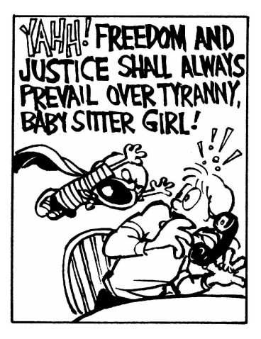
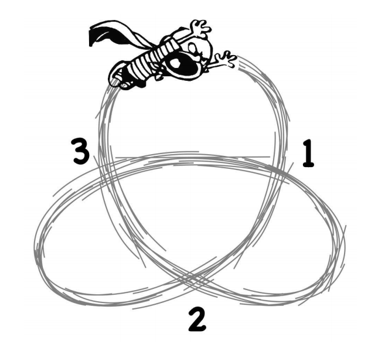

## 문제

Things were grim at Calvin’s house. With his parents gone for the night, the nefarious BabySitter Girl had swooped in and taken over with her oppressive regime of evil and terror. But unfortunately for BabySitter Girl, she was unaware that the house was also home to the greatest superhero that the world has ever seen. Up in his room, the mild-mannered Calvin leapt into his closet and emerged as... STUPENDOUS MAN! Champion of Liberty! Foe of Tyranny! With his muscles of magnitude and heroic resolve, Stupendous Man bravely ran downstairs and fought the evil Rosalyn before escaping out the door and into the night. With BabySitter Girl chasing after him, Stupendous Man had only one option: he must evade BabySitter Girl before sneaking back into the house. Should he get caught, Calvin would get in trouble when his parents got home.

Stupendous Man runs in a swirling, twisting, winding loop across the lawn as fast as he can to try to lose BabySitter Girl. His tremendous speed (KAPWINGGG!) means that BabySitter Girl can only see him where his trajectory crosses over itself. To try to catch him, she writes down and assigns a number to each self-crossing in the order which Stupendous Man passes through them (see Figure 7). Sometimes, she makes a mistake, and that’s when Calv... I mean Stupendous Man... escapes her grasp! If the numbers Rosalyn wrote down in her observations cannot possibly form a single, closed loop, then she is totally confused, has no idea where Calvin is, and must give up on trying to catch him.

Figure 7: Stupendous Man’s trajectory and the three crossings where BabySitter Girl can see him.

## 입력

The input will consist of multiple test cases. Each test case starts with a line that contains a single positive integer N less than or equal to 10. The next line will contain a sequence of 2N integers that Rosalyn has written down based on her observation of Stupendous Man’s trajectory. Numbers are separated by a single space, and it is guaranteed that each number from 1 to N appears exactly twice in the sequence. Note that numbers need not appear first in ascending order! The end of input is marked with a line that contains a single zero.

## 출력

For each test case, print a single line with the word “escaped” if Stupendous Man successfully confuses and evades BabySitter Girl, or “caught” if she manages to untangle his path and find him. Calvin escapes if, and only if, Rosalyn’s labeling cannot form a single, closed loop.
