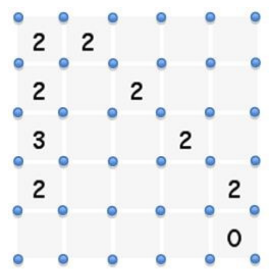
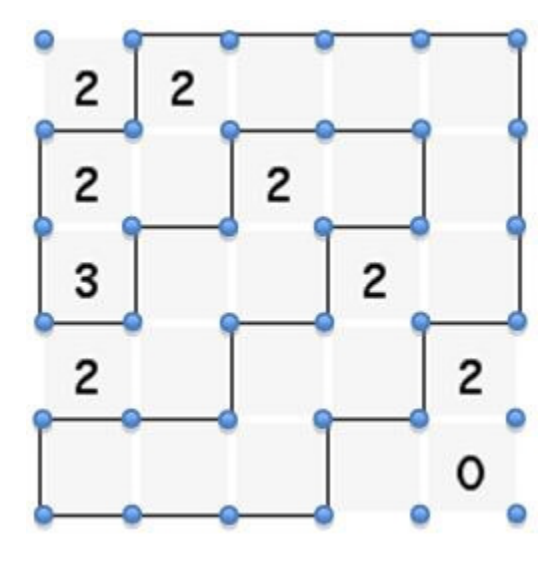

## 문제

Build walls between vertices to form a single enclosed fence without crossings or branches. The number indicates exactly how many walls — according to the crazy city building laws — must surround it (and a lack of number means there’s no constraint.) So, presented with the following 5 x 5 grid of land squares:

the following fence could be constructed:

The grid of lots is always n x n[1 ≤ n ≤ 6], and each lot is either a number (0,1,2, or 3) to impose a constraint, or a blank if no constraint is being imposed. You’re to output the length of the longest possible loop (or equivalently, the number of vertices in the loop), or -1 if no loop exists. Note that loops of length 0 are invalid. A valid loop must enclose a non-zero amount of area.

## 입력

The input is a series of zombie fencing problems, expressed by n, the dimension of the problem, followed by an n x n grid (1 ≤ n ≤ 6) with the number constraints (with the – to represent no constraint), followed by a blank line. End of input is marked by a single 0.

## 출력

For each fence problem, you should print the length of the longest fence loop that can be constructed for that problem while still respecting all constraints, or you should print -1 if the problem has no such solution. There should be no extraneous white space, save for the newlines that separate each of the fence lengths.
