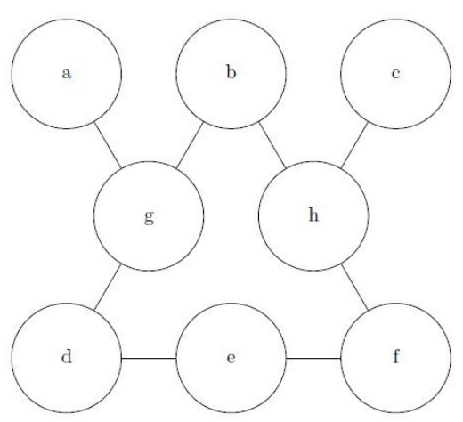
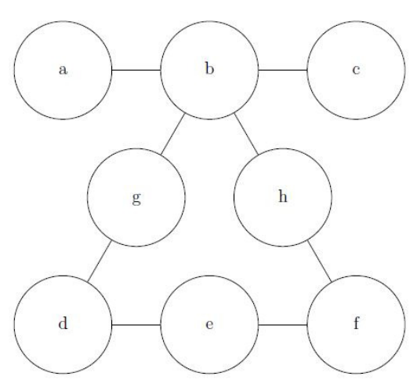
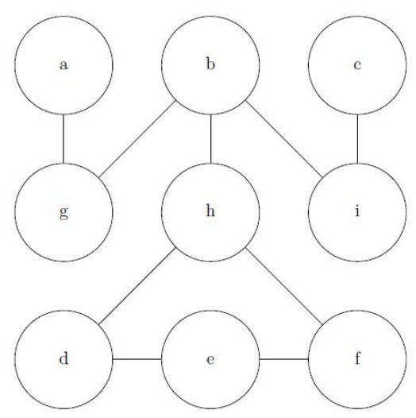

## 문제

In post-apocalyptic California, only six teams of Python programmers remain: three who use CPython and three who use Jython. Unfortunately, C++-programming zombies roam the streets, so the programmers may only leave their safe houses under the guidance of their benevolent dictator, Guido.

The six teams control a network of safe houses, and through discussions on their social network Facelessbook, they have agreed to swap safe houses — that is, the CPython programmers will move to the houses occupied by the Jython programmers, and vice versa. Each night, Guido will guide one team from one safe house to a different, nearby one, and he will do this every night until the six teams have exchanged safe houses.

Each safe house is only large enough for one team, so no two teams can be in the same house at the same time. Tremendous distrust exists between the CPython and the Jython programmers, so they insist that Guido alternate between leading a CPython team and a Jython team (although on the first night he may pick either.)

The network of safe houses is well known, both how many exist, and which pairs of houses are close enough to travel between in a single night. Your job is to determine the minimum number of nights it will take to exchange the six teams, if it can be done at all.

There will be at most twenty safe houses, each identified by a single lower-case letter. The CPython teams start in houses a, b, and c; the Jython teams start in houses d, e, and f. At the end of the transfer, the CPython teams must end up in houses d, e, and f, and the Jython teams must end up in houses a, b, and c.

## 입력

The input will be in a single line, which gives the connections between the houses. Each line will consist of space-separated “words”. Each word indicates a connection between the house represented by the first character of the word, and the houses represented by every subsequent character of the word.

## 출력

For each scenario, if there is a solution, print the minimum number of nights required for the move; if there is no way to make the move, print a single line containing “No solution.”

## 힌트

The first example puzzle, Figure 1, described by gabd hbcf edf, can be solved in 34 moves. (It is presented here in a size where you can try it by hand, by placing pennies on the top row and nickels on the bottom row, and swapping the two rows according to the constraints listed above.)

Figure 1: A moderately difficult puzzle

The next puzzle, shown in Figure 2, described by bacgh dge feh, requires 46 moves.

Figure 2: A harder puzzle

The situation depicted in Figure 3, gab hbdf ibc edf, requires 62 moves.

Figure 3: Good luck with this one!
