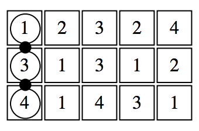
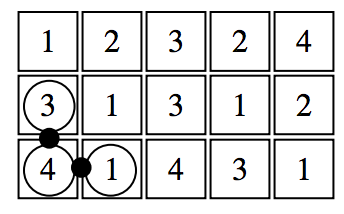
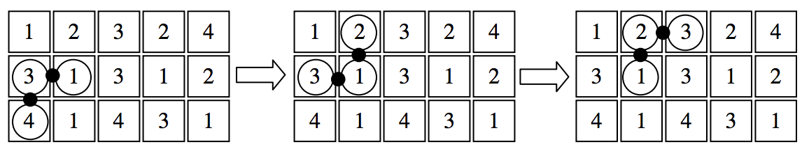
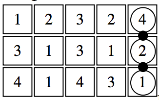

## 문제

The Blenjeel sand worms slither across the sandy surface of the planet Blenjeel. As the planet’s only known inhabits, they protect their homeland by attacking and devouring from underneath anyone who steps foot on their planet.

Of course, the sand worms need to be strong, flexible, and able to slither as quietly as possible. All teenage sand worms are conscripted to a six-month boot camp, where they endure intense training. The most demanding of the training exercise is the famous "wriggle test", which requires worm cadets to slither from one position to a parallel position several hundreds of feet away. Only the toughest, most determined of worms survive.

The exercise is so famous that the Jedi Academy’s CS101 has its students solve a puzzle based on Blenjeel Boot Camp. And that puzzle goes something like this:

Given an n × m board (3 ≤ n ≤ 6, 5 ≤ m ≤ 50) wriggle a Blenjeel sand worm (of length n) from the left column to the right column, ensuring the worm never simultaneously occupies two squares of the same color.

Consider the following 3 × 5 board, where each number represents a different color, and the worm is represented by the chain of circles:

One of two possible moves is to pull the bottom of the worm to the right so it’s positioned as follows:

Now we can pull from the other end of the worm to carry it through three different positions:

Through a series of additional moves, it’s possible to wriggle the worm into the target position where the body of the worm is completely in the rightmost column:

It’s acceptable for the worm to reach the right column in either orientation.

Your job is to write a program that reads in a series of boards as described above, and for each prints out the minimum number of wriggles needed to move the worm from the left column to the right (or -1 if there’s no solution).

## 입력

The data will be n rows of m items. In each row will be digits representing a color (colors are represented by the digits 1 through 7 – not all boards will use all 7 colors). The colors in the leftmost column of each input board are guaranteed to be unique. Each board is separated from the next by a blank line. The end of input will be signaled by a standalone ‘end’. There will be a blank line between the last board and ‘end’.

## 출력

For each board read, print the minimal number of wriggles needed to move the worm from the left column to the right (or -1 if there's no solution) followed by a newline.
