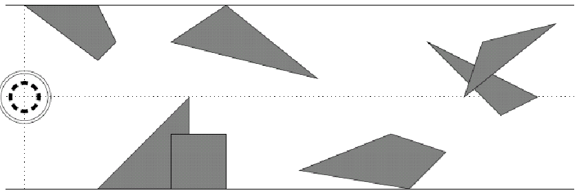

## 문제

R2D2 was exploring a tunnel when a cave-in suddenly occurred. Oh no, is he trapped?

Figure1: Overhead view of the cave crisis from the third example test case.

From an overhead view, we can see all the obstacles (debris) on a two-dimensional Cartesian plane. The tunnel is w cm wide, bounded by the lines y = w / 2 and y = -w / 2. R2D2 starts at (0, 0), and has a perfectly circular footprint of radius r. The exit of the tunnel lies to the right of the line x = 1000. Between R2D2 and the exit lie a number of polygonal obstacles.

Is it possible for R2D2 to navigate between the obstacles and make it to the exit?

## 입력

The input file will contain multiple test cases. Each test case begins with a single line containing an even integer w (2 ≤ w ≤ 1000), the width of the tunnel, and an integer N (0 ≤ N ≤ 100), the number of obstacles. The next N lines each contain the description of a single obstacle. The ith obstacle is a simple polygon, specified on a single line containing an integer ni (3 ≤ ni ≤ 10), the number of vertices, followed by ni pairs of integers, xij and yij (0 ≤ xij ≤ 1000 and -w/2 ≤ yij ≤ w/2 for j = 1, ..., ni ), specifying the coordinates of the vertices in counterclockwise order. Note that obstacles in the input may touch or even overlap. However, you are guaranteed that R2D2’s initial location will not touch or overlap any obstacle. The vertices of each polygon are unique, no two nonconsecutive edges of the polygon intersect (even at their endpoints), and each polygon is guaranteed to have nonzero area. The end-of-input is denoted by an invalid test case with w = N = 0 and should not be processed.

## 출력

For each input test case, you must determine the maximum radius r > 0 that R2D2 could have and still be able to plan a path from his starting location (0, 0) to the tunnel exit without overlapping with any of the obstacles. You should print either this maximum radius r (rounded to two decimal places) or the message “impossible” if no such radius exists.
