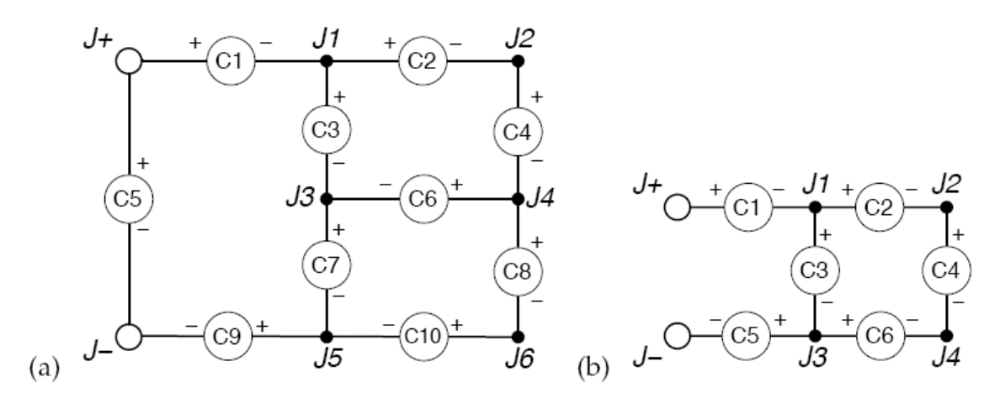

## 문제

You’ve just built a circuit board for your new robot, and now you need to power it. Your robot circuit consists of a number of electrical components that each require a certain amount of current to operate. Every component has a + and a − lead, which are connected on the circuit board at junctions. Current flows through the component from + to − (but note that a component does not “use up” the current: everything that comes in through the + end goes out the − end).

The junctions on the board are labeled 1, ..., N, except for two special junctions labeled + and − where the power supply terminals are connected. The + terminal only connects + leads, and the − terminal only connects − leads. All current that enters a junction from the − leads of connected components exits through connected + leads, but you are able to control how much current flows to each connected + lead at every junction (though methods for doing so are beyond the scope of this problem). Moreover, you know you have assembled the circuit in such a way that there are no feedback loops (components chained in a manner that allows current to flow in a loop).

Figure 1: Examples of two valid circuit diagrams. In (a), all components can be powered along directed paths from the positive terminal to the negative terminal. In (b), components 4 and 6 cannot be powered, since there is no directed path from junction 4 to the negative terminal.

In the interest of saving power, and also to ensure that your circuit does not overheat, you would like to use as little current as possible to get your robot to work. What is the smallest amount of current that you need to put through the + terminal (which you can imagine all necessarily leaving through the − terminal) so that every component on your robot receives its required supply of current to function?

## 입력

The input file will contain multiple test cases. Each test case begins with a single line containing two integers: N (0 ≤ N ≤ 50), the number of junctions not including the positive and negative terminals, and M (1 ≤ M ≤ 200), the number of components in the circuit diagram. The next M lines each contain a description of some component in the diagram. The i th component description contains three fields: pi, the positive junction to which the component is connected, ni, the negative junction to which the component is connected, and an integer Ii (1 ≤ Ii ≤ 100), the minimum amount of current required for component i to function. The junctions pi and ni are specified as either the character ‘+’ indicating the positive terminal, the character ‘-’ indicating the negative terminal, or an integer (between 1 and N) indicating one of the numbered junctions. No two components have the same positive junction and the same negative junction. The end-of-file is denoted by an invalid test case with N = M = 0 and should not be processed.

## 출력

For each input test case, your program should print out either a single integer indicating the minimum amount of current that must be supplied at the positive terminal in order to ensure that every component is powered, or the message “impossible” if there is no way to direct a sufficient amount of current to each component simultaneously.
