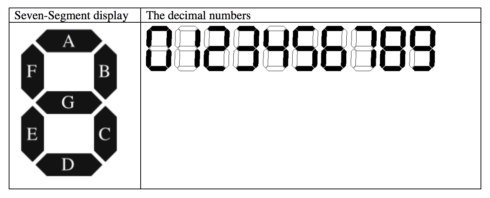

## 문제

While travelling through the wilderness on Earth (and discussing the concept of a ‘Zeroeth’ Robotic Law), R. Daneel Olivaw and R. Giskard Reventlov happened upon a small device protruding from the ground. After some initial analysis, the two robots determine it is an ancient calculating device. More specifically, it appears to be a four function calculator. Unfortunately the display is covered with centuries of debris which appears difficult to remove. Amazingly, the calculator still functions, but of course you can’t see the results. This calculator has a display constructed from seven-segment LEDs, as shown here:

This particular calculator only displays three digits of accuracy. There are three seven segment digits, and there are no decimal points since all math is performed using integers (with truncation where appropriate).

If the number on the display happens to be negative, there is a minus sign in front of the number. For a number such as -6, this is done buy making the right-most digit a “6” and using the middle segment of the next digit over as the minus sign. For a number such as -123, there is one additional segment to the left of the display. Thus, the number -112 lights up 10 segments, made up of 9 for the number, and one more for the minus sign. The display thus ranges from “-999” to “999”. There is no “plus sign” for positive numbers.

In order to prove that the calculator still operates, and justify scraping off the paint, the back cover is removed and an ammeter is attached to the display. An ammeter measures the current consumed by the device, and each segment of a digit consumes 5 milliamps per segment. Thus, to display a number such as “798” the current consumption can be predicted as follows:

* Digit 7 – 3 segments lit = 15 milliamps
* Digit 9 – 6 segments lit = 30 milliamps
* Digit 8 – 7 segments lit = 35 milliamps
* Total = 80 milliamps

Of course, it’s apparent that the number “897” also consumes the same amount of current, as does “789” or, for that matter, “-891”.

The calculator allows you to enter numbers with an optional minus sign and up to three digits, and to either add, subtract, multiply, or divide the numbers. Daneel wishes to prove that the functionality of the calculator is intact, so he enters “949” and measures 80 milliamps. Then he pushes the subtract key. Next he enters “51” and measures 35 milliamps. After pressing the “=” key the result should be “898”, measuring 100 milliamps. As a second example, he enters “-5”, then pushes the addition key. He then enters “-4” and presses equal. The answer is “-9”; the measurements were 30 milliamps, 25 milliamps, and 35 milliamps respectively.

Giskard is unsure of this result, so he presents Daneel with the following problem: given the current consumption (milliamps) of operand X, operand Y, and result Z, and given unknown operation Op, determine all possible values for X Op Y = Z, assuming that possible solutions exist. If no such solutions exist, report it as shown in the **Sample Output** section.

The calculator has only three digits on the display, and neither Giskard nor Daneel are sure what it will do if the result of an expression is outside the range of -999 to 999. Thus, they will not consider such expressions as possible solutions.

## 입력

There will be multiple cases. Each input line except the last contains three integer values between 0 and 999, inclusive, each separated by a space, which are the X, Y, and Z values for a single case. Each number is in milliamps according to the above description. The last line will contain the single value 0, indicating the end of the problem set.

## 출력

Note that no leading zeros should be considered – the number “12” for example, is never entered on the calculator as “012” even though the result of the calculation may be the same. Thus, no expression should contain numbers with leading zeros, either as input or as result. For each case, find all possible expressions and report how many there are in a grammatically correct form, as shown below, as well as echoing back the input.

## 힌트

An example is as shown above; for inputs 80, 35, 100 one result is “925 – 117 = 808”. Some input combinations have no result. For the inputs 35, 10, 10 there is no expression that matches those readings. For any given input set, the program should determine all of the valid expressions and print the number of expressions found.
