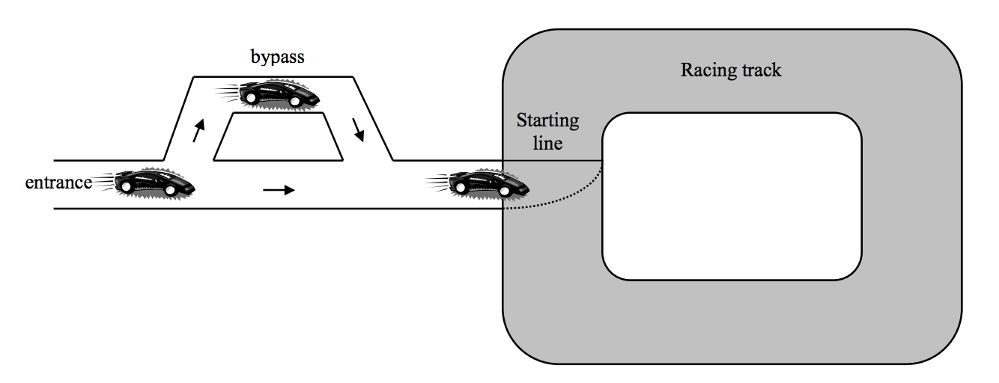

## 문제

A car racing will be held in the track illustrated below.

As shown above, there is only one lane leading to the starting line. So the racing cars should be line up at the starting line in the order of their numbers which have been assigned according to the records in the preliminary race. When the cars arrive at the main entrance in a certain order, we want to find out whether we can rearrange the cars in the increasing order of their numbers by using a one -lane bypass. Note that the cars should move only forward as designated by the arrows shown in the figure. Also, note that the cars in the bypass should be in a line because the bypass has only one lane. You can assume that the bypass is long enough to accommodate all the cars which participate in the race.

For instance, suppose there are four competitors and they arrive in the order 1, 3, 2, 4. Then we can rearrange the cars so that they can line up in the order 1, 2, 3, 4 at t he starting line as follows: let the car numbered ‘1’ first reach the starting line and the car numbered ‘3’ enter the bypass and wait for the car numbered 2. After the car numbered ‘2’ reaches the starting line, the car numbered ‘3’ comes out from the bypass and arrives the starting line. Finally the car numbered 4 reaches the starting line.

## 입력

The input consists of several test cases. The first line of the input file contains an integer representing the number of test cases. Each test case begins with a line containing an integer N , indicating the number of cars which participate in the race. The following line represents a permutation of N cars, numbered 1,2,…,N. The consecutive car numbers are separated by a single space. Assume that N is less than 100.

## 출력

Print exactly one line for each test case in the output. The line should contain “YES” if the test case can be rearranged, and contain “NO” otherwise.
