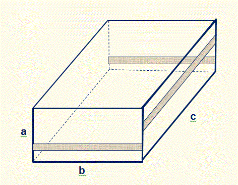

## 문제

The Mayor of Halloween Town was always concerned about saving money. When the Pumpkin King, Jack Skelington decided to try his hand at stealing Christmas again, the mayor began trying to cut corners wherever he could to afford it. They were in a recession, after all! When the great Jack commanded him to order enough wrapping paper for all the presents, the Mayor wanted to make sure he would only the absolute minimum amount. In order to do that, he has asked you, the local computer ghoul to write a problem to calculate the amount of wrapping paper that each of the different types of gifts would take. Thankfully for you, all of the gifts are able to fit in different sizes of rectangular boxes (The vampire trio, who is in charge of presents this year, got their start in manufacturing things while interns at Ikea). Each present can be represented by a name, and the three dimensions of the box `a`, `b`, `c` (`0 < a <= b <= c`) in frightometers.

The procedure for wrapping the gift is first, a large sheet of wrapping paper is laid on a flat surface. Then, the box is placed on the wrapping paper with one of its '`bc`' faces resting on the wrapping paper. The wrapping paper is folded around the four '`c`' edges and the excess is cut off, leaving a 3 frightometer wide overlap on one of the '`ac`' faces (shown shaded in the figure). At this point, the wrapping paper has the form of a long rectangular tube.

Now more wrapping paper is cut off at the two ends of the tube. It is cut flush with the '`a`' edges. Along the '`b`' edges, rectangular flaps remain. These rectangular flaps are cut so that when they are folded along the '`b`' edges, they cover the two '`ab`' faces with a 3 frightometer wide overlap (overlapping areas shown shaded in the figure). The excess paper can be recycled (The Shadow on the Moon at night is an accomplished paper maker!), so that isn't to be taken into account. Calculate the amount of paper, in square frightometers that each box needs in order to be properly wrapped.

## 입력

Input will begin with a single line containing a single integer, `n > 0`, where `n` is the number types of boxes you need to process. The following `n` lines start with the name of a product, in single quotes followed by three integers, `a`, `b` and `c` which represent the three dimensions of the package, as illustrated in the picture above. Following the dimensions, a number of significant digits to include in the answer. The number of significant digits will never be greater than the number of digits in the answer. None of the dimensions will be greater than 10,000.

## 출력

Output will consist of `n` lines of the form: `"<Present Name> requires <total paper area> square frightometers of paper to wrap"`
