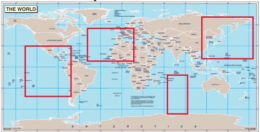

## 문제

Data Co is having trouble organizing its vast collection of data. It has dozens of sets of survey data that span large portions of the globe. The bounding boxes of these surveys are stored so that anyone curious about a specific region's geological information merely needs to enter in some coordinates to retrieve the data; and that's where you come in...

## 입력

The input file contains two lists, with each entry separated by a line break. The first is a list of bounding boxes stored in the system (These will be referred to as “Data Boxes”). The second is a list of bounding boxes that represent user queries (“Query Boxes”). Each list is preceded by the number of items in that list.

Bounding boxes are represented by two Latitude/Longitude coordinates. The first represents a top corner of the box, the second represents the opposite corner of the box. The two points are separated by a space.

## 출력

The program must determine which Data Boxes are touched in any way (sharing borders counts) by Query Boxes. The program should print out all Data Boxes touched by Query Boxes. If multiple Query Boxes touch the same Data Box, the coordinates of the Data Box must only be printed out once.

If no "touching" data and query boxes are found print "`No data found.`" without the quotes.

## 힌트

Latitude and Longitude are angular measurements. Lines of Latitude are the horizontal lines on the globe. The Equator has a Latitude of `0°`, the North Pole has a Latitude of `90°`, and the South Pole has a Latitude of `-90°`. Lines of Longitude, called ‘Meridians’ wrap vertically around the globe, always starting and ending at the poles. The Prime Meridian, which passes through Greenwich England, has a Longitude of `0°`. Longitude values ‘wrap around’ at the opposite Meridian at `±180`. Longitude decreases as you go west of the Prime Meridian until it ‘wraps around’ at `-180` (for example, New Orleans is at Longitude `-90`). Longitude increases as you go east of the Prime Meridian, again until it wraps around at `180` (Beijing is at Longitude `116`).

Both Query and Data Boxes can wrap ‘around the middle’ of the globe, but may not wrap ‘over the top’ of the globe.
