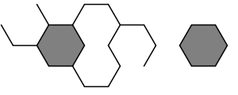

## 문제

A windstorm has knocked over a beekeeper's hive boxes. A hive box contains a number of panels. Each panel contains a honeycomb. The panels are thin enough that the bees create a single layer of hexagonal cells in each panel. All cells are hexagonal and of uniform size.

Upon inspecting the panels, the beekeeper discovers that many of the hexagonal cells have been damaged. Given as input a list of line segments representing undamaged cell walls, compute the number of undamaged (i.e. containing all six walls) hexagons in the panel. You can assume that the only damage to the honeycomb is that some cell walls are missing, but none of them are moved, broken in half, etc. Below is an example honeycomb with the undamaged hexagons shaded in gray:

## 입력

Input to this problem will begin with a line containing a single integer *N* (1 ≤ *N* ≤ 100) indicating the number of data sets. Each data set begins with a line containing a single integer *S* (1 ≤ *S* ≤ 1000) specifying the number of line segments in the data set. This is followed by *S* lines of the form "*X1*`,`*Y1*  *X2*`,`*Y2*" which specify the individual cell walls of the honeycomb. Each coordinate is a floating point number greater than or equal to zero but less than or equal to 1000 and with at most 3 digits after the decimal point (i.e. rounded to the nearest thousandth). The coordinates will *not* use "exponent notation" such as "`3.123e+3`".

You can make the following assumptions about the input:

* The length of each cell wall is 1 unit
* The honeycomb will have the same orientation as the example figure. In other words, if the top or bottom cell walls of a unit are present, they will be always parellel to the x-axis.
* There will be no duplicate or overlapping cell walls. The line segments can only touch each other at the endpoints.

## 출력

For each data set, print the number of undamaged hexagonal cells that were detected.
