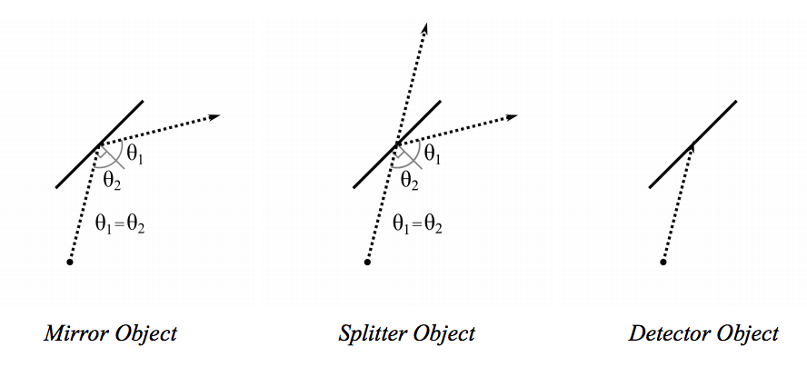

## 문제

악마 박승원은 세계에서 가장 강력한 레이저를 찾기 위해 당신을 찾았다. 당신은 레이저 프로토타입이 있지만, 박승원에게 레이저 제작 예산을 받기 위해서는 시뮬레이션을 박승원에게 보여주어야 한다.

시뮬레이션은 2차원 평면 상에서 "거울", "광선 스플리터", "광선 감지기" 를 둠으로써 시작된다. 각 물체들은 선분으로 모델링된다.

* 거울 : 거울에 닿는 광선은 반대 방향으로 나아간다.
* 감지기 : 감지기는 들어오는 광선을 흡수한다.
* 스플리터 : 스플리터는 들어오는 광선을 두 광선으로 나눈다 - 한 광선은 스플리터를 관통하는 방향, 나머지 광선은 스플리터에 반사되는 방향이다.

시작점과 방향이 주어진 레이저가 발사되었을 때. 당신은 어떠한 감지기가 광선을 흡수했는지를 구해야 한다. 문제를 쉽게 하기 위해 다음과 같은 가정이 가능하다.

* 100 \* 100 크기의 사각형 구역만 시뮬레이션하면 되며, 모든 물체는 해당 구역 안에 존재한다.
* 주어지는 선분들이 겹치거나 교점을 갖는 일은 없다.
* 사각형 구역의 가장자리에서 레이저는 발사된다.
* 시뮬레이션은 모든 광선이 테이블을 빠져나오거나 감지기에 흡수당했을 때 종료된다.
* 레이저 광선은 시뮬레이션을 통틀어 100번 이상 반사되지 않는다.
* 감지기는 1개 이상 존재한다.
* 시뮬레이션 과정에서 레이저 광선이 어떠한 물체와 한 직선 상에 놓여있는 일은 없다.

## 입력

첫 번째 줄에는 테스트 데이터의 수 N이 주어진다. 주어지는 데이터들은 다음과 같다 -

* 첫 번째 줄에는 "x,y i,j" 꼴로 테이블의 가장자리 중 하나인 시작점 (x,y) 와, 레이저 광선의 방향벡터 (i,j) 가 주어진다. (−1024 ≤ i,j ≤ 1024) 주어지는 수는 모두 정수이다.
* 두 번째 줄에는 물체의 수 P가 주어진다. (1 ≤ P ≤ 100)
* 이후 P개의 줄에 각각 물체들이 주어진다. "M"은 거울, "S"는 스플리터, "D"는 감지기를 뜻하며, 물체가 점유하는 각 끝점 두개가 "x,y" 꼴로 주어진다.

## 출력

각각의 테스트 케이스에 대해 먼저 첫 줄에 "DATA SET #k"를 출력하라. k는 테스트 케이스의 번호다.

만약 레이저 빔을 흡수한 감지기가 없다면, "NO BEAMS DETECTED"를 출력한다.

이외의 경우 레이저를 흡수한 감지기의 번호를 오름차순으로 출력하라.

## 힌트

Enigma - The Screen Behind The Mirror
