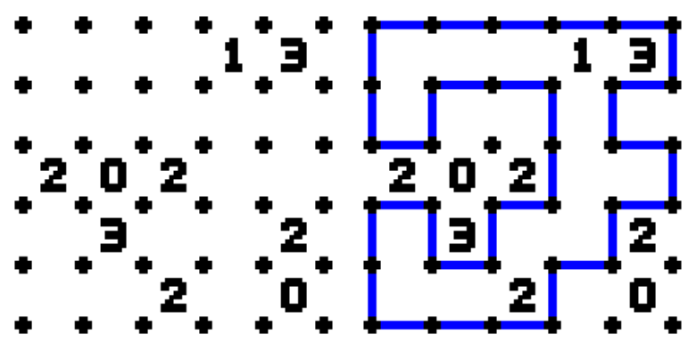

## 문제

Slitherlink is a type of logic puzzle made popular by Nikoli, the same Japanese puzzle company that has made Sudoku popular the world over. Like most good logic puzzles, it has a set of very basic rules that can nonetheless result in devilishly difficult (and delightful!) puzzling experiences.

The rules of Slitherlink are as follows:

A Slitherlink board is made up of a lattice of dots; in this problem, it will be a regular rectangular lattice.  
Some of the boxes (or cells) defined by the lattice have numbers within them; with a regular rectangular lattice, the numbers will be between 0 and 3 inclusive.  
The goal of a Slitherlink puzzle is to connect adjacent dots (horizontally or vertically, like the sides of boxes) so that there is a single loop that never crosses itself, with no line segments that are not part of the loop (no "dangling" segments or other, separate loops) such that every cell that has a number has exactly that many sides as segments of the loop.

Left: Unsolved 5x5 Puzzle, Right: Solved 5x5 Puzzle

Given a supposedly solved Slitherlink puzzle, your task will be to determine whether or not it is indeed legitimately solved.

## 입력

Input to this problem will begin with a line containing a single integer N (1 ≤ N ≤ 100) indicating the number of data sets. Each data set consists of the following components:

* A line containing two integers H, W (1 ≤ H,W ≤ 20) representing the height and width of the Slitherlink puzzle by the number of cells (not dots!) per edge;
* A series of 2H + 1 lines representing the Slitherlink puzzle, using the following non-whitespace characters:
  + 0, 1, 2, 3, ?: The numbers written inside a given cell. A ? represents an empty cell, as in the example graphic above.
  + #: A dot in the lattice.
  + -, |: A horizontal or vertical line segment.
  + .: An empty adjacency between two dots in the lattice.

Note that all Slitherlink puzzles will be fully represented; that is, there is no internal whitespace on a given line to represent empty cells or adjacencies.

## 출력

For each data set, print "VALID" if the solution is a valid solution to the given Slitherlink, or "INVALID" if the solution is not valid.
