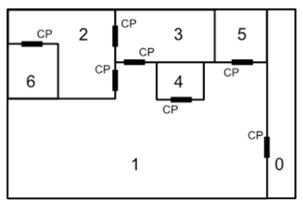

## 문제

You are the lead programmer for the Securitron 9042, the latest and greatest in home security software from Jellern Inc. (Motto: We secure your stuff so YOU can't even get to it). The software is designed to "secure" a room; it does this by determining the minimum number of locks it has to perform to prevent access to a given room from one or more other rooms. Each door connects two rooms and has a single control panel that will unlock it. This control panel is accessible from only one side of the door. So, for example, if the layout of a house looked like this:

with rooms numbered 0-6 and control panels marked with the letters "CP" (each next to the door it can unlock and in the room that it is accessible from), then one could say that the minimum number of locks to perform to secure room 2 from room 1 is two; one has to lock the door between room 2 and room 1 and the door between room 3 and room 1. Note that it is impossible to secure room 2 from room 3, since one would always be able to use the control panel in room 3 that unlocks the door between room 3 and room 2.

## 입력

Input to this problem will begin with a line containing a single integer x indicating the number of datasets. Each data set consists of two components:

1. Start line – a single line "m n" (1 <=m<= 20; 0 <=n<= 19) where m indicates the number of rooms in the house and n indicates the room to secure (the panic room).
2. Room list – a series of m lines. Each line lists, for a single room, whether there is an intruder in that room ("I" for intruder, "NI" for no intruder), a count of doors c (0 <= c <= 20) that lead to other rooms and have a control panel in this room, and a list of rooms that those doors lead to. For example, if room 3 had no intruder, and doors to rooms 1 and 2, and each of those doors' control panels were accessible from room 3 (as is the case in the above layout), the line for room 3 would read "NI 2 1 2". The first line in the list represents room 0. The second line represents room 1, and so on until the last line, which represents room m - 1. On each line, the rooms are always listed in ascending order. It is possible for rooms to be connected by multiple doors and for there to be more than one intruder!

## 출력

For each dataset, output the fewest number of locks to perform to secure the panic room from all the intruders. If it is impossible to secure the panic room from all the intruders, output "PANIC ROOM BREACH". Assume that all doors start out unlocked and there will not be an intruder in the panic room.
