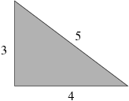
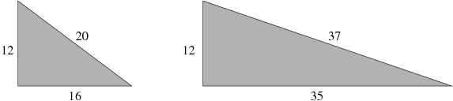

## 문제

피타고라스의 정리는 직각삼각형의 세 변의 관계를 나타내는 정리이다. 빗변의 길이를 C, 다른 두 변의 길이를 A, B라고 한다면 다음과 같은 식으로 쓸 수 있다.

A2 + B2 = C2

세 변의 길이가 모두 자연수인 직각삼각형 중에 가장 유명한 삼각형은 아래와 같다.

A = 12인 경우에는 다음과 같이 두 개의 직사각형을 찾을 수 있다.

A가 주어졌을 때, 빗변의 길이 C가 자연수인 직각삼각형을 만드는 자연수 B (B > A)는 몇 개가 있을까?

## 입력

입력은 여러 개의 테스트 케이스로 이루어져 있다. 각 테스트 케이스는 한 줄로 이루어져 있고, 자연수 A (2 ≤ A < 220)이 주어진다. 입력의 마지막 줄에는 0이 하나 주어진다.

## 출력

입력으로 주어진 A에 대해서, 빗변의 길이가 자연수인 직각삼각형을 만드는 B(B>A)의 개수를 출력한다.
