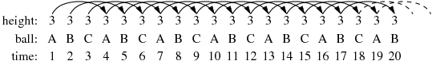
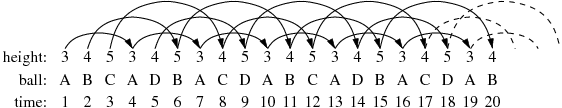
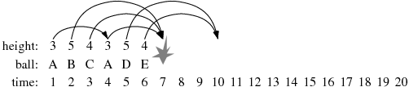

## 문제

Many people are familiar with a standard 3-ball juggling pattern in which you throw ball A, then ball B, then ball C, then ball A, then ball B, then ball C, and so on. Assuming we keep a regular rhythm of throws, a ball that is thrown higher into the air will take longer to return, and therefore will take longer before the next time it gets thrown. We say that a ball thrown to height *h* will not be thrown again until precisely *h* steps later in the pattern. For example, in the standard 3-ball pattern, we say that each ball is thrown to a height of 3, and therefore thrown again 3-steps later in the pattern. For example, ball A that we throw at time 1 of the process will be next thrown at time 4.

By convention, we label the first ball thrown as A, and each time we introduce a new ball into the pattern, we label it with the next consecutive uppercase letter (hence B and then C in the classic pattern).

There exist more complex juggling patterns. Within the community of jugglers, a standard way to describe a pattern is through a repeating sequence of numbers that describe the height of each successive throw. This is known as the ***siteswap*** notation.

To demonstrate the notation, we first consider the "3 4 5" siteswap pattern. This describes an infinite series of throws based on the repeating series "3 4 5 3 4 5 3 4 5 ...". The first throw the juggler makes will be to a height of 3, the second throw will be to a height of 4, the third throw to a height of 5, the fourth throw to a height of 3 (as the pattern repeats), and so forth.

While the siteswap pattern describes the heights of the throws, the actual movement of individual balls does not follow as obvious a pattern. The following diagram illustrates the beginning of the "3 4 5" pattern.

The first throw is ball A, thrown to a height of 3, and thus ball A is not thrown again until time 4. At time 2, we must make a throw with height 4; since ball A has not yet come back, we introduce a second ball, conventionally labeled B. Because ball B is thrown at time 2 with a height of 4, it will not be thrown again until time 6. At time 3, we introduce yet another ball, labeled C, and throw it to height 5 (thus it will next be thrown at time 8). Our next throw, at time 4, is to have height 3. However, since ball A has returned (from its throw at time 1), we do not introduce a new ball; we throw A. At time 5, we are to make a throw with height 4, yet we must introduce a new ball, D, because balls A, B, and C are all still up in the air. (Ball D is the last ball to be introduced for this particular pattern.) The juggling continues with ball B being thrown to height 5 at time 6, and so on.

The "3 4 5" siteswap pattern works out nicely. It happens to be a 4-ball pattern, because after introducing ball D, the juggler can now continue until his or her arms get tired. Unfortunately, not all siteswap sequences are legitimate!

Consider an attempt to use a siteswap pattern "3 5 4". If we were only interested in making six throws, everything works well. But a problem arises at time 7, as shown in the following diagram.

Ball B was thrown at time 2 with a height of 5. Therefore, it should get its next turn to be thrown at time 7. However, ball C was thrown at time 3 with a height of 4, and so it too should get its next turn at time 7. (To add insult to injury, ball A gets thrown at time 4 with height of 3, also suggesting it get its next turn at time 7.) What we have here is a problem, resulting in a lot of balls crashing to the ground.

## 입력

Each line represents a separate trial. It starts with the number *1 ≤ P ≤ 7* which represents the period of the repeating pattern, followed by *P* positive numbers that represent the throw heights in the pattern. An individual throw height will be at most 19. The input is terminated with a single line containing the value 0.

## 출력

For each pattern, output a single line describing the first 20 throws for the given pattern, if 20 throws can be legally made. Otherwise, output the word `CRASH`. You need not be concerned with any crashes due to balls landing strictly after time 20.
