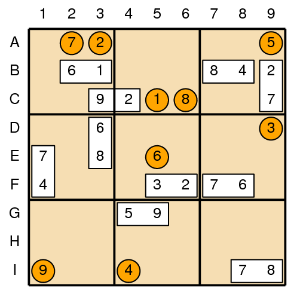
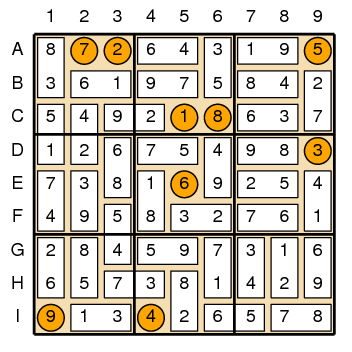

## 문제

스도쿠가 세계적으로 유행이 된 이후에, 비슷한 퍼즐이 매우 많이 나왔다. 게임 매거진 2009년 7월호에는 스도쿠와 도미노를 혼합한 게임인 스도미노쿠가 소개되었다.

이 퍼즐은 스도쿠 규칙을 따른다. 스도쿠는 9×9 크기의 그리드를 1부터 9까지 숫자를 이용해서 채워야 한다. 스도쿠는 다음과 같은 조건을 만족하게 숫자를 채워야 한다.

* 각 행에는 1부터 9까지 숫자가 하나씩 있어야 한다.
* 각 열에는 1부터 9까지 숫자가 하나씩 있어야 한다.
* 3×3크기의 정사각형에는 1부터 9가지 숫자가 하나씩 있어야 한다.

스도미노쿠의 그리드에는 1부터 9까지 숫자가 쓰여져 있고, 나머지 72칸은 도미노 타일 36개로 채워야 한다. 도미노 타일은 1부터 9까지 서로 다른 숫자의 가능한 쌍이 모두 포함되어 있다. (1+2, 1+3, 1+4, 1+5, 1+6, 1+7, 1+8, 1+9, 2+3, 2+4, 2+5, ...) 1+2와 2+1은 같은 타일이기 때문에, 따로 구분하지 않는다. 도미노 타일은 회전 시킬 수 있다. 또, 3×3 크기의 정사각형의 경계에 걸쳐서 놓여질 수도 있다.

왼쪽 그림은 퍼즐의 초기 상태를 나타내고, 오른쪽은 퍼즐을 푼 상태이다.

스도미노쿠의 퍼즐의 초기 상태가 주어졌을 때, 퍼즐을 푸는 프로그램을 작성하시오.

## 입력

입력은 여러 개의 테스트 케이스로 이루어져 있다. 각 테스트 케이스의 첫째 줄에는 채워져 있는 도미노의 개수 N이 주어진다. (10 ≤ N ≤ 35) 다음 N개 줄에는 도미노 하나를 나타내는 U LU V LV가 주어진다. U는 도미노에 쓰여 있는 한 숫자이고, LU는 길이가 2인 문자열로 U의 위치를 나타낸다. V와 LV는 도미노에 쓰여 있는 다른 숫자를 나타낸다. 도미노의 위치는 문제에 나와있는 그림을 참고한다. 입력으로 주어지는 도미노의 각 숫자 위치는 항상 인접해 있다.

N개의 도미노의 정보가 주어진 다음 줄에는 채워져 있는 숫자의 위치가 1부터 9까지 차례대로 주어진다. 위치는 도미노의 위치를 나타낸 방법과 같은 방법으로 주어진다.

모든 도미노와 숫자가 겹치는 경우는 없다.

입력의 마지막 줄에는 0이 하나 주어진다.

## 출력

각 퍼즐에 대해서, 스도쿠를 푼 결과를 출력한다. 항상 답이 유일한 경우만 입력으로 주어진다.
