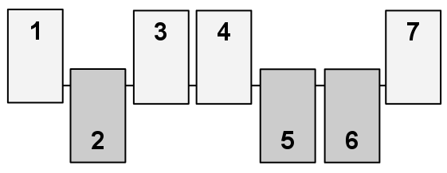

## 문제

Shut the Box is a one-player game that begins with a set of N pieces labeled from 1 to N. All pieces are initially "unmarked" (in the picture at right, the unmarked pieces are those in an upward position). In the version we consider, a player is allowed up to T turns, with each turn defined by an independently chosen value V (typically determined by rolling one or more dice). During a turn, the player must designate a set of currently *unmarked* pieces whose numeric labels add precisely to V, and mark them. The game continues either until the player runs out of turns, or until a single turn when it becomes impossible to find a set of unmarked pieces summing to the designated value *V* (in which case it and all further turns are forfeited). The goal is to mark as many pieces as possible; marking all pieces is known as "shutting the box." Your goal is to determine the maximum number of pieces that can be marked by a fixed sequence of turns.

As an example, consider a game with 6 pieces and the following sequence of turns: 10, 3, 4, 2. The best outcome for that sequence is to mark a total of four pieces. This can be achieved by using the value 10 to mark the pieces 1+4+5, and then using the value of 3 to mark piece 3. At that point, the game would end as there is no way to precisely use the turn with value 4 (the final turn of value 2 must be forfeited as well). An alternate strategy for achieving the same number of marked pieces would be to use the value 10 to mark four pieces 1+2+3+4, with the game ending on the turn with value 3. But there does not exist any way to mark five or more pieces with that sequence.

Hint: avoid enormous arrays or lists, if possible.

## 입력

Each game begins with a line containing two integers, N, T where 1 ≤ N ≤ 22 represents the number of pieces, and 1 ≤ T ≤ N represents the maximum number of turns that will be allowed. The following line contains T integers designating the sequence of turn values for the game; each such value V will satisify 1 ≤ V ≤ 22. You must read that entire sequence from the input, even though a particular game might end on an unsuccessful turn prior to the end of the sequence. The data set ends with a line containing 0 0.

## 출력

You should output a single line for each game, as shown below, reporting the ordinal for the game and the maximum number of pieces that can be marked during that game.
