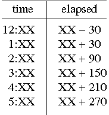

## 문제

In our region, the contest traditionally starts at 12:30 and lasts for 5 hours. If you are able to submit a solution at 12:39, the wise judges would determine that 9 minutes had elapsed since the start of the contest. Sadly, as the day grows longer, the judges have more trouble doing the calculations accurately (how quickly can you determine the elapsed time for a 3:21 submission?)

Having struggled for many years, the judges developed the following system. Before the contest starts, they place the following table on the board at the front of the room

When a problem is submitted with a given time-stamp, they determine which row of the table to use, based upon the hour of the time-stamp. Then, the formula in the right column is used to compute the number of elapsed minutes. For example, with a submission time of 12:39, the top row is applied with XX=39, leading to the elapsed minutes calculated as 39 - 30 = 9. For a program submitted at 3:21, the fourth row is used to calculate 21 + 150 = 171 elapsed minutes.

Your goal is to develop a program that generates the appropriate table given knowledge of the starting time and duration of a contest.

## 입력

The input starts with a line containing a single integer 1 ≤ N ≤ 30 that is the number of cases. Following this are N lines, with each line containing integral values SH, SM, DH, DM separated by spaces. The values 1 ≤ SH ≤ 12 and 0 ≤ SM ≤ 59 respectively represent the hour and minute at which a contest starts. The values 0 ≤ DH ≤ 10 and 0 ≤ DM ≤ 59 represent the duration of the contest in terms of hours and minutes. A contest will last at least 1 minute and at most 10 hours and 59 minutes. This allows us to omit any A.M. or P.M. designations for the times.

## 출력

For each case, you are to produce a table formatted as shown in the Example Output. Any row in which the hour designator is a single digit (e.g., 5:XX) should have a single leading space, as should the header of the table just before the word "time".

The table must have a row for every hour block in which a program might be submitted. Assume that the earliest possible submission is precisely the contest starting time (i.e., 0 elapsed minutes), and that the latest possible submission has an elapsed time of the full duration of the contest (e.g., 5:30 in our region).
