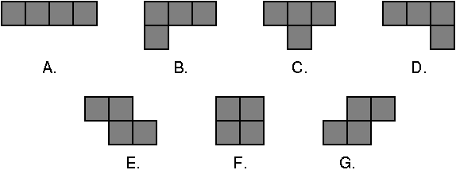
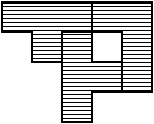
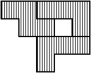

## 문제

The game Top This is played with pieces made up of four unit squares placed so that each square shares a side with at least one other square. This results in the following seven pieces:

Fig. 1: The playing pieces

To play the game you are given three red pieces and three blue pieces. Your goal is to arrange the three red pieces on a grid so that they do not overlap each other (although they may have incident sides), and then to arrange the three blue pieces on top of the red pieces so that they cover precisely the same squares.

For example, suppose our red pieces include shape B and two copies of shape C, and our blue pieces were shape B, shape D, and shape E. We could create identical shapes by combining them like so:

Fig. 2: Combination of B, C, and C

Fig. 3: Combination of B, D, and E

Notice that you may rotate each piece independently to whatever orientation you choose. However, you may not flip the piece over. (Doing so would change a piece of shape B to a piece of shape D, and vice versa; it would similarly swap E and G.)

Your job is to solve a Top This puzzle and report a shape that can be made from both groups of pieces, if possible. We further constrain the problem by only considering solutions that can be placed on a six-by-six grid. It is possible that there will be more than one solution to the puzzle—and even if there is only one solution, there will be many different positions and orientations that the shape could be in. You are to give the shape that comes first based on the following ordering:

Given two solutions, examine the squares in row-major order (i.e., from left-to-right in each row, starting with the top row) until you find the first square that is different between the two. The solution in which the square is filled comes before the solution in which the square is empty.

## 입력

The first line of input contains a number T, where 1 ≤ T ≤ 5. The remaining T lines represent T data sets, one per line. Each data set consists of a string of three characters, a single space, and another string of three characters. Each character will be an uppercase letter from A to G representing one of the seven pieces as labeled in Figure 1 above. The first three characters will be the red pieces; the last three characters will be the blue pieces.

## 출력

For each data set you should first output the ordinal of the data set on its own line: 1 for the first set, 2 for the second, and so on. After the ordinal should be the solution, printed as six lines with six characters per line. Each character represents a unit square—a hash mark (#) indicates a filled square, while a period (.) indicates an empty square. The filled squares should describe the first shape that can be formed by both the red pieces and the blue pieces, as per the ordering defined above. If there is no possible solution, simply print “No solution” on a single line.
