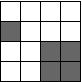
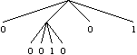
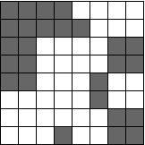
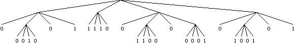
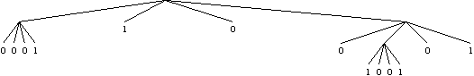
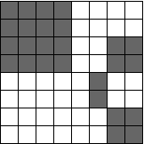

## 문제

Strategies for compressing two-dimensional images are often based on finding regions with high similarity. In this problem, we explore a particular approach based on a hierarchical decomposition of the image. For simplicity, we consider only bitmapped images such as the following:

The image is encoded as a tree, with the root representing the entire image region. If a region is monochromatic, then the node for that region is a leaf storing the color of the region. Otherwise, the region is divided into four parts about its center, and the approach is applied recursively to each quadrant. For a non-leaf node, its four children represent the four quadrants ordered as upper-right, upper-left, lower-left, lower-right respectively. As an example, here is the tree encoding of the above image.

The original image is not monochromatic, so we considered the four quadrants. The top-right quadrant is monochromatic white, so the first child of the root node is a leaf with value 0. The top-left quadrant is not monochromatic, so it is further divided into four subquadrants, each of which is trivially monochromatic. This results in the subtree with leaf values 0, 0, 1, 0. The final two quadrants are monochromatic with respective values 0 and 1.

As a larger example, here is an 8x8 image and the tree encoding of it.

Thus far we have described a lossless compression scheme, but the approach can be used for lossy compression with the following adjustment. Instead of continuing the decomposition until reaching a monochromatic region, a threshold such as 75% is used, and a leaf is created whenever a region has at least that percentage of either color. As an example, here is the encoding of the above 8x8 image if using 75% as the threshold.

Notice that 75% of the top-left quadrant of the full image is black, and therefore the second child of the root is 1, and that more than 75% of the bottom-left quadrant of the full image is white, and therefore the third child of the root is 0. However, neither white nor black reaches 75% in the top-right quadrant, so the recursive decomposition continues, but all four of those subquadrants achieve the 75% threshold and become leaves. If we were to uncompress the image based on this new lossy encoding, we get back the following result.

Your goal is to determine the image that results from this lossy compression scheme, given an original bitmap image and a specific threshold percentage.

## 입력

The input will consist of a series of data sets, followed by a line containing only 0. Each data set begins with a line containing values W and T, where W is the width of the bitmap and T is the threshold percentage. Images will always be square with 1 ≤ W ≤ 64 being a power of two. Threshold T will be an integer with 51 ≤ T ≤ 100. Following the specification of W and T are W additional lines, each of which is a string of width W containing only characters 0 and 1, representing a row of the image bitmap, from top to bottom.

## 출력

For each data set, you should print an initial line of the form "Image 1:" numbering the images starting with 1. Following that should be W lines, with each line representing a row of the resulting bitmap as a string of characters 0 and 1, from top to bottom.
