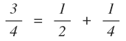
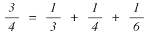
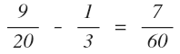
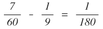
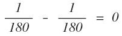
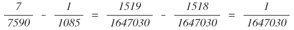
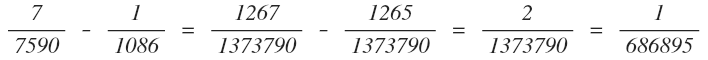
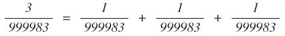
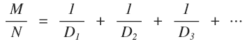

## 문제

이집트 왕국(기원전 2000년)의 이집트인은 분수를 쓰는 새로운 방법을 개발했다. 단위분수를 나타내는 상형문자를 만든 뒤, 그 상형문자로 분수를 나타냈다.

하지만, 이 방법을 이용한다면 분자가 1보다 큰 분수를 나타낼 수가 없었다. 따라서, 이집트 인은 단위분수를 더하는 방식으로 분수를 나타냈다. 예를 들어, 3/4는 다음과 같이 나타낼 수 있다.

어떤 분수를 나타내는 방법이 여러 가지일수도 있다. 3/4는 다음과 같이 나타낼 수 있다.

분수 M/N이 주어졌을 때, 이 분수를 그리디 방법을 이용해서 단위분수의 합으로 나타내려고 한다. 그리디 방법은 그 분수에서 뺄 수 있는 가장 큰 단위 분수를 0이 될 때 까지 계속해서 빼는 방법이다. 예를 들어, 9/20을 그리디 방법을 이용한다면 1/3 + 1/9 + 1/180으로 나타낼 수 있다.

이 방법을 이용해서 나온 단위분수가 너무 커지는 것을 막기위해, 다음과 같은 제한을 추가한다. 단위분수를 빼고난 후에 나온 분수의 분모는 1,000,000보다 작아야 한다.

예를 들어, 17/69에서 시작했을 때, 처음 두 단위분수는 1/5와 1/22가 되고 7/7590이 남게 된다. 이 상태에서 뺄 수 있는 가장 큰 분수는 1/1085가 된다.

위에서 볼 수 있듯이 가장 큰 분수로 빼게되면 남은 분수의 분모는 백만보다 크게 된다. 따라서, 1/1085를 사용할 수 없게 된다. 다음으로 큰 단위분수인 1/1086을 빼면 다음과 같게 된다.

항상 분모의 크기는 1,000,000보다 작아야 하기 때문에, 위와 같이 단위분수로 나눠야 한다. 따라서, 정답은 1/5 + 1/22 + 1/1086 + 1/686895가 된다.

모든 분수는 항상 분모가 같은 단위분수의 합으로 나타낼 수 잇기 때문에, 정답이 존재하지 않는 경우는 없다. 예를 들면 3/999983과 같은 경우다.

## 입력

입력은 여러 개의 테스트 케이스로 이루어져 있다. 각 테스트 케이스는 한 줄로 이루어져 있고, M과 N이 주어진다. (1 < M < N < 100) M과 N은 분수 M/N을 나타내며, 두 수의 최대공약수는 항상 1이다. 마지막 줄에는 0 0이 주어진다.

## 출력

입력으로 주어진 분수 M/N이 다음과 같이 나타낼 수 있다면, D1, D2, D3, ...를 공백으로 구분해 출력한다. (D1 ≤ D2 ≤ D3 ≤ ....)

