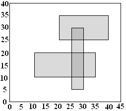

## 문제

The ACM Student Chapter has just been given custody of a number of school bulletin boards. Several members agreed to clear off the old posters. They found posters plastered many levels deep. They made a bet about how much area was left clear, what was the greatest depth of posters on top of each other, and how much of the area was covered to this greatest depth. To determine each bet's winner, they made very accurate measurements of all the poster positions as they removed them. Because of the large number of posters, they now need a program to do the calculations. That is your job.

A simple illustration is shown above: a bulletin board 45 units wide by 40 high, with three posters, one with corners at coordinates (10, 10) and (35, 20), another with corners at (20, 25) and (40, 35), and the last with corners at (25, 5) and (30, 30). The total area not covered by any poster is 1300. The maximum number of posters on top of each other is 2. The total area covered by exactly 2 posters is 75.

## 입력

The input will consist of one to twenty data sets, followed by a line containing only 0. On each line the data will consist of blank separated nonnegative integers.

The first line of a dataset contains integers n w h, where n is the number of posters on the bulletin board, w and h are the width and height of the bulletin board. Constraints are 0 < n ≤ 100; 0 < w ≤ 50000; 0 < h ≤ 40000.

The dataset ends with n lines, each describing the location of one poster. Each poster is rectangular and has horizontal and vertical sides. The x and y coordinates are measured from one corner of the bulletin board. Each line contains four numbers xl yl xh and yh, where xl and yl, are the lowest values of the x and y coordinates in one corner of the poster and xh and yh are the highest values in the diagonally opposite corner. Each poster fits on the bulletin board, so 0 ≤ xl < xh ≤ w, and 0 ≤ yl < yh ≤ h.

## 출력

There is one line of output for each data set containing three integers, the total area of the bulletin board that is not covered by any poster, the maximum depth of posters on top of each other, and the total area covered this maximum number of times.

Caution: An approach examining every pair of integer coordinates might need to deal with 2 billion coordinate pairs.
