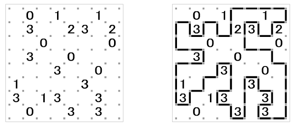
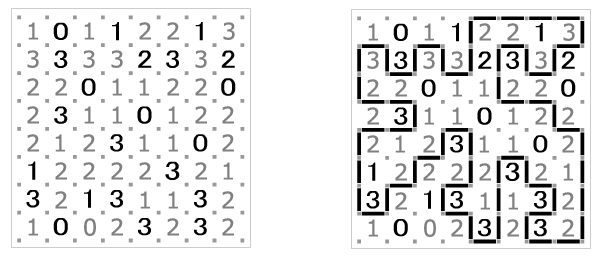

## 문제

Slitherlink is a puzzle published by Nikoli, the Japanese company that popularized Sudoku. Slitherlink puzzles are gaining momentum, and books of Slitherlink puzzles have started showing up around the world. The puzzles are simple to understand, but can be challenging to solve. The puzzle is simply a rectangular grid of dots that forms a collection of cells, every cell being either blank or containing an integer from zero to three. The challenge is to connect the dots with line segments to form a cycle (a connected path such that every vertex has precisely two incident edges), in such a way that every cell with a value has exactly the number of incident edges as the digit it contains. Cells with no value may have any number of incident edges. A valid Slitherlink puzzle always contains sufficient non-empty cells to guarantee a unique solution. Below is an example from the Nikoli web site of a Slitherlink puzzle and its solution.

It was shown by Takayuki Yato at the University of Tokyo that the general Slitherlink problem is NP-complete. (If you are not familiar with this concept, informally it means there is no "efficient" algorithm to solve the problem.) With a slight modification and some simple heuristics, however, programmatic solutions are possible. Our new puzzle, which we will term Slink, differs from Slitherlink only in that the puzzle may not have empty cells. That is, every cell must specify the number of incident edges. Below is the Slitherlink puzzle above converted to Slink (the added numbers are shown in gray). Note that the solution does not change, only the information given in the puzzle itself.

The heuristics for solving Slink arise from the nature of the puzzle itself. For example, consider a cell containing a zero. There must be no incident edges, therefore all edges incident to all zeros can be immediately removed from consideration as part of the solution path. Consider a three next to a zero. Because all the edges incident to the zero will be eliminated, the common edge shared with the three is also eliminated. But that leaves only three edges around the three, and therefore those three edges must be part of the solution path. The following table specifies the heuristic rules that must be properly applied to solve a Slink puzzle. The "x" characters between vertices mark edges that are not part of the solution path, while line segments between vertices mark edges that form part of the solution. Grey elements are the pattern the rule is based on, black elements indicate the additional edges that should be included or excluded if the rule is matched. Note that the pictured examples are for demonstration purposes only and do not illustrate every possible arrangement of the stated rule!

| Examples | Rule Specification | Examples | Rule Specification |
| --- | --- | --- | --- |
| case 1 | The easiest and most obvious of all the rules. Cells containing a zero have no incident edges, so all the edges around a zero should be removed from consideration as part of the solution path. | case 2    case 3 | If a cell contains the value *n* and only *n* incident edges remain (i.e. have not been eliminated), then the *n* remaining edges must be part of the solution path. Two examples of this occurring are shown here. |
| case 4    case 5 | If a cell contains the value *n* and *n* incident edges have already been included in the path, the remaining edges can be eliminated. Two examples of this occurring are shown here. | case 6 | If two 3's are adjacent to one another, the common edge between the cells as well as the outer edges of both cells are part of the solution path. One example of this arrangement occurring is shown here. |
| case 7 | If two 3's occur diagonally adjacent, the opposing corners as shown here must be part of the solution path. One example of such an arrangement is shown here. | case 8 | If an edge enters a vertex for which only a single exit remains, that exit must be part of the solution path. One such example is shown here. |
| case 9 | If a vertex has two incident edges, the other edges can be eliminated from consideration as part of the solution path. One such example is shown here. | case 10 | If any vertex has three incident edges excluded, the fourth incident edge can be excluded as well. One possible arrangement of this occurring is shown here. |
| case 11 | A 3 for which two of the exits are blocked as shown, such as in a corner of the puzzle, must include the two edges incident to the blocked vertex. | case 12 | If the exits at one corner of a 2 are blocked, and one exit at an adjacent vertex around the 2 is also blocked, then the unblocked exit at that adjacent vertex must be part of the solution path. One example of this arrangement is shown here. |
| case 13 | A 1 for which the exit paths at one of its incident vertices are both blocked as shown, such as might occur in the corner of the puzzle, must also eliminate the other two edges incident to that vertex as shown. | case 14 | If the solution path enters the corner of a 3, and the exit that goes away from the 3 at that same corner is blocked, then the two edges around the three incident to the opposite corner must be part of the solution path. |
| case 15 | If a 3 and 1 are diagonally adjacent, and the corner of the 3 furthest from the 1 has the exit segments blocked as shown, then the edges incident to the far corner of the 1 becomes blocked. The opposite is also true; if the far corner of the 1 had been blocked, then the exit segments at the far corner of the 3 would become blocked in the same manner. | case 16 | If the solution path enters the corner of 2 and the path leading away from the 2 at the same corner is blocked, then if one of the paths leading away from the 2 at the diagonally opposite corner is also blocked, the other edge leading away from the 2 at that same corner must be part of the solution path. One example of this arrangement occurring is shown here. |
| case 17 | If the solution path enters the corner of a 1, and the exit that goes away from the 1 at that same corner is blocked, then the two edges around the three incident to the opposite corner must be eliminated from the solution path. |  |  |

## 입력

The input for this problem is a set of Slink puzzles to be solved. The first line of a Slink problem's input contains two integers, r and c, separated by a space, the number of rows and the number of columns in the puzzle. The next r rows of the input contain c integers, space delimited, valued from 0 to 3, which specify the content of the puzzle. The minimum dimension of a puzzle is 2 by 2 cells, and the maximum dimension is 20 by 20 cells. It is guaranteed that a unique solution to every input puzzle exists and can be determined with the above rules if a rule is always applied when it can be applied. A line with values of zero for r and c marks the end of the input.

## 출력

The output for this problem is a graphical representation of the Slink puzzle solution. The first data set is 1, the second data set is 2, etc. On a line by itself display the data set number, followed by the solution in exactly the format demonstrated below. Vertical edges are output as the vertical bar '|' character, horizontal edges are output as dash '-' characters, vertices where the path changes direction are output as plus signs '+', and cell numbers are always displayed with a blank to the left and to the right. Further, surround the entire output with a border made up of hash marks '#' such that the number in the upper left cell of the puzzle always occurs four positions to the right of the border and three position below the border, and the number in the lower right cell always occurs four positions to the left of the border and three positions above the border.
