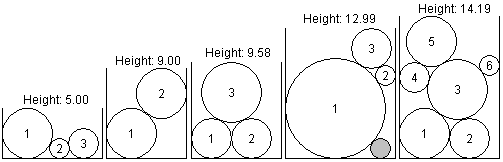

## 문제

Imagine disks of ice falling, one at a time, into a box, each ending up at the lowest point it can reach without overlapping or moving previous disks. Each disk then freezes into place, so it cannot be moved by later disks. Your job is to find the overall height of the final combination of disks.

So that the answer is unique, assume that any disk reaching the bottom of the box rolls as far to the left as possible. Also the data is chosen so there will be a unique lowest position for any disk that does not reach the bottom. The data is also such that there are no "perfect fits": each disk that lands will be in contact with only two other points, on previous circles or the sides of the box. The illustrations above show white filled disks labeled with the order in which they fall into their boxes. The gray circle in the fourth illustration is not intended to be a disk that fell in. The gray disk is included to demonstrate a point: the gray disk is the same size as disk 2, so there is space for disk 2 on the very bottom of its box, but disk 2 cannot reach that position by falling from the top. It gets caught on disk 1 and the side of the box.

One way to find the top intersection point of two intersecting circles is as follows. Suppose circle 1 has center (x1, y1) and radius r1, and suppose circle 2 has center (x2, y2), and radius r2. Also assume that circle 1 is to the left of circle 2, i.e., x1 < x2. Let

* dx = x2 - x1,
* dy = y2 - y1,
* D = sqrt(dx\*dx + dy\*dy),
* E = (r1\*r1 - r2\*r2 + D\*D)/(2\*D),
* F = sqrt(r1\*r1 - E\*E);

then the upper intersection point is (x1 + (E\*dx - F\*dy)/D, y1 + (F\*dx + E\*dy)/D).

## 입력

The input consists of one or more data sets, followed by a line containing only 0 that signals the end of the input. Each data set is on a line by itself and contains a sequence of three or more blank-separated positive integers, in the format w, n, d1, d2, d3, ..., dn, where w is the width of the box, n is the number of disks, and the remaining numbers are the diameters of the disks, in the order in which they fall into the box. You can assume that w < 100, that n < 10, and that each diameter is less than w.

## 출력

For each data set, output a single line containing the height of the pile of disks, rounded to two places beyond the decimal point.

The example data matches the illustrations above.
