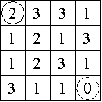
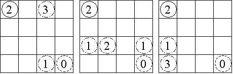

## 문제

An n x n game board is populated with integers, one nonnegative integer per square. The goal is to travel along any legitimate path from the upper left corner to the lower right corner of the board. The integer in any one square dictates how large a step away from that location must be. If the step size would advance travel off the game board, then a step in that particular direction is forbidden. All steps must be either to the right or toward the bottom. Note that a 0 is a dead end which prevents any further progress.

Consider the 4 x 4 board shown in Figure 1, where the solid circle identifies the start position and the dashed circle identifies the target. Figure 2 shows the three paths from the start to the target, with the irrelevant numbers in each removed.

Figure 1

Figure 2

## 입력

The input contains data for one to thirty boards, followed by a final line containing only the integer -1. The data for a board starts with a line containing a single positive integer n, 4 ≤ n ≤ 34, which is the number of rows in this board. This is followed by n rows of data. Each row contains n single digits, 0-9, with no spaces between them.

## 출력

The output consists of one line for each board, containing a single integer, which is the number of paths from the upper left corner to the lower right corner. There will be fewer than 263 paths for any board.

## 힌트

Brute force methods examining every path will likely exceed the allotted time limit. 64-bit integer values are available as long values in Java or long long values using the contest's C/C++ compilers.
