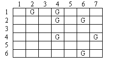
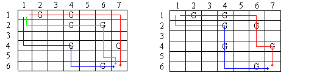

## 문제

Your company provides robots that can be used to pick up litter from fields after sporting events and concerts. Before robots are assigned to a job, an aerial photograph of the field is marked with a grid. Each location in the grid that contains garbage is marked. All robots begin in the Northwest corner and end their movement in the Southeast corner. A robot can only move in two directions, either to the East or South. Upon entering a cell that contains garbage, the robot will pick it up before proceeding. Once a robot reaches its destination at the Southeast corner it cannot be repositioned or reused. Since your expenses are directly proportional to the number of robots used for a particular job, you are interested in finding the minimum number of robots that can clean a given field. For example, consider the field map shown in Figure 1 with rows and columns numbered as shown and garbage locations marked with a 'G'. In this scheme, all robots will begin in location 1,1 and end in location 6, 7.

Figure 1 - A Field Map

Figure 2 below shows two possible solutions, the second of which is preferable since it uses two robots rather than three.

Figure 2 - Two Possible Solutions

Your task is to create a program that will determine the minimum number of robots needed to pick up all the garbage from a field.

## 입력

An input file consists of one or more field maps followed by a line containing -1 -1 to signal the end of the input data. A field map consists of one or more lines, each containing one garbage location, followed by a line containing 0 0 to signal the end of the map. Each garbage location consists of two integers, the row and column, separated by a single space. The rows and columns are numbered as shown in Figure 1. The garbage locations will be given in row-major order. No single field map will have more than 24 rows and 24 columns. The sample input below shows an input file with two field maps. The first is the field map from Figure 1.

## 출력

The output will consist of a single line for each field map containing the minimum number of robots needed to clean the corresponding field.
