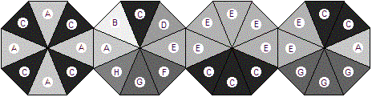
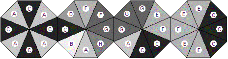

## 문제

Bracelet 1

Bracelet 2

Bracelets can be made from a collection of octagonal pieces, with two opposite sides of an octagon attached to octagons on either side. The colors of the edges of the octagons vary. The different colors are labeled with different letters in the diagrams. Bracelets only look good if the connecting sides of two adjacent octagons are the same color. Above are two possible bracelets. (The ends also get fastened together.) These two bracelets could be made from the same four octagons, reordered and rotated. Assume that the octagons are never flipped over.

It happens that the better selling bracelets are those with the darker colors on the edges connecting the bracelet. The brightness of each lettered color is a positive integer, with higher numbers being brighter. Suppose the brightness of the labeled colors are:

| A | B | C | D | E | F | G | H |
| --- | --- | --- | --- | --- | --- | --- | --- |
| 70 | 90 | 10 | 50 | 60 | 30 | 20 | 40 |

We can compare the desirability of these two arrangements of the octagons by adding the brightness of the colors at each joint (including the connection of the two ends). For Bracelet 1, colors A, A, E, and E have sum 70 + 70 + 60 + 60 = 260. For Bracelet 2, colors C, C, G, and E have sum 10 + 10 + 20 + 60 = 100. Bracelet 2 is preferable, having the smaller sum. In fact, Bracelet 2 provides the best possible result among all rearrangements and rotations of these four octagons.

## 입력

There are from one to 20 data sets, followed by a final line containing only 0. A data set starts with a line containing nine blank-separated integers. The first is the number, n, of octagons that form the bracelet, where 4 ≤ n ≤ 11. The remaining eight numbers are the brightness for colors A through H, in order. Each brightness is positive and less than 256.

The next n lines each contain eight letters, all in the range from A through H. Each gives the edge colors for one octagon, in clockwise order. Individual colors may appear zero or more times in the octagons. Different colors may have the same brightness, but that does not make them the same color.

## 출력

The output contains one line for each data set: If no bracelet can be constructed using all the octagons, the line contains "impossible". Otherwise the line contains the minimal sum of the brightness for the connections. Caution: If your solution considers all possible orderings and rotations individually, it will run out of time.
