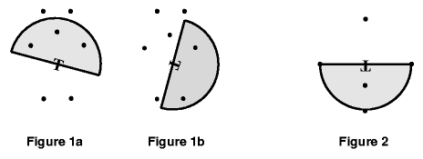

## 문제

In a wireless network with multiple transmitters sending on the same frequencies, it is often a requirement that signals don't overlap, or at least that they don't conflict. One way of accomplishing this is to restrict a transmitter's coverage area. This problem uses a shielded transmitter that only broadcasts in a semicircle.

A transmitter *T* is located somewhere on a 1,000 square meter grid. It broadcasts in a semicircular area of radius *r*. The transmitter may be rotated any amount, but not moved. Given *N* points anywhere on the grid, compute the maximum number of points that can be simultaneously reached by the transmitter's signal. Figure 1 shows the same data points with two different transmitter rotations.

## 입력

All input coordinates are integers (0-1000). The radius is a positive real number greater than 0. Points on the boundary of a semicircle are considered within that semicircle. There are 1-150 unique points to examine per transmitter. No points are at the same location as the transmitter.

Input consists of information for one or more independent transmitter problems. Each problem begins with one line containing the (x,y) coordinates of the transmitter followed by the broadcast radius, r. The next line contains the number of points N on the grid, followed by N sets of (x,y) coordinates, one set per line. The end of the input is signalled by a line with a negative radius; the (x,y) values will be present but indeterminate. Figures 1 and 2 represent the data in the first two example data sets below, though they are on different scales. Figures 1a and 2 show transmitter rotations that result in maximal coverage.

## 출력

For each transmitter, the output contains a single line with the maximum number of points that can be contained in some semicircle.
