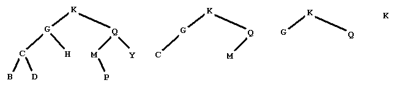

## 문제

Consider the following sequence of operations on a binary search tree of letters

Remove the leaves and list the data removed   
Repeat this procedure until the tree is empty

Starting from the tree below on the left, we produce the sequence of trees shown, and then the empty tree

  
   
by removing the leaves with data

BDHPY   
CM   
GQ   
K

Your problem is to start with such a sequence of lines of leaves from a binary search tree of letters and output the preorder traversal of the tree.

## 입력

The input file will contain one or more data sets.  Each data set is a sequence of one or more lines of capital letters.  The lines contain the leaves removed from a binary search tree in the stages described above.  The letters on a line will be listed in increasing alphabetical order.  Data sets are separated by a line containing only an asterisk ('\*').  The last data set is followed by a line containing only a dollar sign ('\$').  There are no blanks or empty lines in the input.

## 출력

For each input data set, there is a unique binary search tree that would produce the sequence of leaves.  The output is a line containing only the preorder traversal of that tree, with no blanks.
