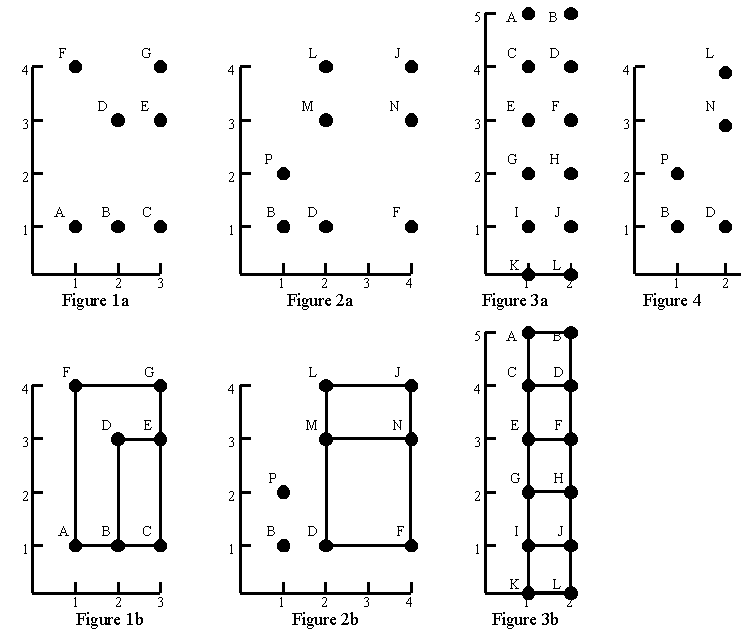

## 문제

Consider the point sets in figures 1a, 2a, and 3a. Using only those points as vertices, figures 1b, 2b, and 3b show all the rectangles that can be formed with horizontal and vertical sides. No rectangles can be formed from the points in figure 4.

Your task is to write a program that can find all rectangles that can be formed from a given set of points. The example input and output given below correspond to the figures above.

## 입력

The input file contains one or more point sets, followed by a line containing the number 0 that signals the end of the file. Each point set begins with a line containing n, the number of points, and is followed by n lines that describe the points. Each point description contains a capital letter that is the label of the point, then a space, the horizontal coordinate, a space, and the vertical coordinate. Within each set, points labels occur in alphabetical order. Note that since each point is labelled with a capital letter there can be at most 26 points. All coordinates are nonnegative integers less than 50. Points within a set are unique.

## 출력

The output for each point set starts with "Point set ", followed by the number of the point set and a colon. If there are no rectangles, " No rectangles" appears after the colon. If there are rectangles, they are listed starting on the next line. A blank precedes each rectangle. Each rectangle is given by its vertex labels, in clockwise order from the upper left, so the order is upper left, upper right, lower right, lower left. The rectangles are listed ten per line, except for the last line, where there may be as few as one. The rectangles are listed in alphabetical order.
